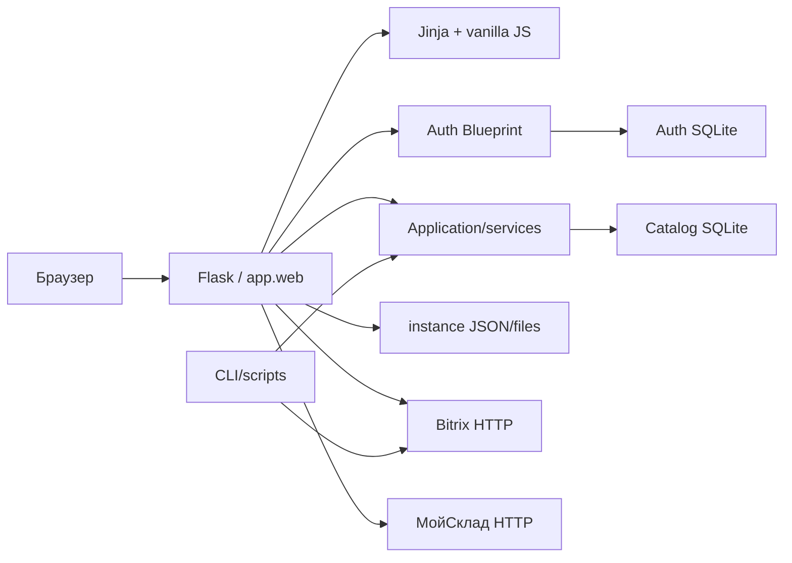

# Фактическая архитектура

Baseline: `3158cb7de5328bd71d28fd6bff30b46edc27fb9b` (`origin/main`), 2026-08-14.

## Контекст и зависимости

Доказательства: создание Flask app и подключение auth находятся в
[`app/web.py`](../../app/web.py) и [`app/auth.py`](../../app/auth.py); SQLite
схемы — в [`app/catalog_db.py`](../../app/catalog_db.py) и `AuthStore` в
[`app/auth.py`](../../app/auth.py); HTTP clients — в
[`app/clients`](../../app/clients); server UI — в
[`app/templates`](../../app/templates).

## Фактические слои

| Слой | Что находится сейчас | Фактические зависимости и нарушения |
| --- | --- | --- |
| HTTP/routes | 143 rules в `web.py`, auth Blueprint, adapter classes настроек и sales reports | Routes напрямую вызывают services, clients, JSON helpers и иногда SQL; единая dependency rule отсутствует ([`app/web.py`](../../app/web.py), [`app/auth.py`](../../app/auth.py)) |
| Application/use cases | `CatalogApplication`, `SettingsApplication`, report context builder; часть use cases остаётся функциями `web.py` | Application зависит от переданных collaborators, но создаётся глобально в composition root; покрытие доменов неравномерно ([`app/catalog/application.py`](../../app/catalog/application.py), [`app/system_settings/application.py`](../../app/system_settings/application.py), [`app/sales_reporting/application.py`](../../app/sales_reporting/application.py)) |
| Domain/business rules | Валидация продаж/остатков, ремонтов, классификации, категорий | Правила представлены functions/classes в `services`, но значительная часть правил заказов, UI forms, аналитики и интеграционной оркестрации остаётся в routes ([`app/services/sales_inventory.py`](../../app/services/sales_inventory.py), [`app/services/repair_cases.py`](../../app/services/repair_cases.py), [`app/web.py`](../../app/web.py)) |
| Services | Inventory, receipt, audit, imports, reconciliation, taxonomy | Некоторые сервисы содержат и rules, и raw SQL; это практический service/data-access слой, не чистый domain ([`app/services`](../../app/services)) |
| Repositories/data access | `CatalogDatabase`, `AuthStore`; raw SQL внутри сервисов | Отдельных repository interfaces почти нет. `CatalogDatabase.transaction()` задаёт SQLite boundary, services знают таблицы ([`app/catalog_db.py`](../../app/catalog_db.py), [`app/auth.py`](../../app/auth.py)) |
| ORM/models | ORM отсутствует; SQLite rows и dictionaries | Schema задана SQL-строками, domain entities как отдельные types отсутствуют ([`app/catalog_db.py`](../../app/catalog_db.py)) |
| Integrations | Bitrix catalog/orders/status, МойСклад products/stock/documents | Clients вызываются непосредственно из `web.py`; write side не участвует в локальной SQLite-транзакции ([`app/clients`](../../app/clients), [`app/web.py`](../../app/web.py)) |
| Presentation | Большие Jinja templates, shared CSS/JS и page-local CSS/JS | View-model часто формируется в `web.py`; шаблоны также содержат много поведения ([`app/templates`](../../app/templates), [`app/static`](../../app/static)) |
| Shared infrastructure | Flask app/config, time ranking, settings/cache/path helpers | Composition, globals, caches и paths смешаны с routes в `web.py` ([`app/web.py`](../../app/web.py), [`app/config.py`](../../app/config.py)) |

## Связанность

`app.web` импортирует auth, catalog, sales reporting, settings, 14 service/client
modules и общие helpers. Сервисы продаж/приходов/журнала зависят от конкретной
SQLite-схемы. Внутренний AST-граф импортов выявил один цикл:
`app.services.product_classification ↔ app.services.bitrix_erp_product_sync`;
его стороны видны в соответствующих imports
([classification](../../app/services/product_classification.py),
[sync](../../app/services/bitrix_erp_product_sync.py)). Это единственный цикл
между Python-модулями `app/`, а не доказательство отсутствия runtime coupling.

## Запуск и фоновые задачи

`app.web:app` — composition root; development entry point вызывает
`app.run()` ([`app/web.py`](../../app/web.py)). Репозиторий не содержит worker или
scheduler. Автоматизация синхронизации вне процесса не подтверждена. Доступны
Flask CLI `sync-bitrix-products`, `repair-product-classification`, auth admin
commands и отдельные scripts; запуск у них ручной, если внешний scheduler не
настроен за пределами Git ([`app/web.py`](../../app/web.py),
[`app/auth.py`](../../app/auth.py), [`scripts`](../../scripts)).

CI запускает isolated Python unittest/compileall и frontend typecheck/lint/test/
build без credentials ([`.github/workflows/tests.yml`](../../.github/workflows/tests.yml)).

## Подтверждённые дефекты контрактов

`/overview`, `/orders`/`/order/<id>` и `/analytics` вызывают `render_template`
для `overview.html`, `orders.html`, `analytics.html`, которых нет в
[`app/templates`](../../app/templates). Jinja lookup этих трёх имён завершается
`TemplateNotFound`; routes поэтому имеют статус `broken`, даже если до render
выполняется прикладная или внешняя работа ([`app/web.py`](../../app/web.py),
[`tests/test_bitrix_orders.py`](../../tests/test_bitrix_orders.py)). Исправление
не входит в этот аудит.

## Pending work и неизвестное

Незакоммиченные или неслитые ветки не исследовались и не входят в current state.
Не подтверждены production commit/config, расписания внешних jobs, реальные
объёмы, recovery rehearsal и authoritative owner каждой сущности. Исторические
планы React/PostgreSQL перечислены в [реестре](../document-register.md), но не
считаются реализацией.
