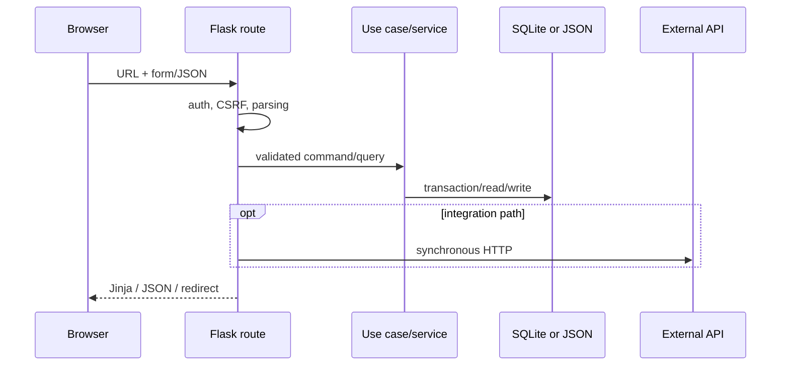

# Потоки запросов

Ниже показаны фактические цепочки baseline. `web` означает функции в
[`app/web.py`](../../app/web.py); все write requests сначала проходят global
auth/CSRF guard из [`app/auth.py`](../../app/auth.py).

## Catalog и inventory

| Сценарий | Фактическая цепочка | Нарушение/контракт | Tests |
| --- | --- | --- | --- |
| Просмотр товаров | `GET /warehouse` или `/app/products` → `warehouse_page` → query filters/pagination → `CatalogApplication`/catalog services + optional remote enrichment → view-model в route → `warehouse.html` | Route знает filter state, storage shapes, external availability и presentation ([route](../../app/web.py), [application](../../app/catalog/application.py), [template](../../app/templates/warehouse.html)) | [`test_unified_server_pagination.py`](../../tests/test_unified_server_pagination.py), [`test_warehouse_product_photos.py`](../../tests/test_warehouse_product_photos.py) |
| Создание/изменение товара | POST `/warehouse/add` или `/warehouse/edit` и product API → form/JSON validation in route → `ExcelProductCatalog`/`SharedCatalog` transaction → SQLite product/audit → optional МойСклад update → redirect/JSON | Local and remote effects are not one transaction; route performs orchestration and presentation mapping ([route](../../app/web.py), [catalog service](../../app/services/excel_product_catalog.py), [client](../../app/clients/moysklad.py)) | [`test_excel_product_catalog.py`](../../tests/test_excel_product_catalog.py), [`test_moysklad_catalog_mapping.py`](../../tests/test_moysklad_catalog_mapping.py) |
| Приход | POST `/receipts/create` or `/api/v1/receipts` → validation/catalog resolution in `web` → `ReceiptInventory.create/post/update` → one `CatalogDatabase.transaction()` updates receipt, items, products, movements → optional МойСклад document orchestration → redirect/JSON | SQLite changes are atomic inside service; remote document and compatibility JSON paths are outside that ACID boundary ([routes](../../app/web.py), [service](../../app/services/receipt_inventory.py)) | [`test_stage2_receipts_api.py`](../../tests/test_stage2_receipts_api.py), [`test_unified_catalog_inventory.py`](../../tests/test_unified_catalog_inventory.py) |
| Изменение остатка | POST `/warehouse/stock` → route validation/current item → local catalog update and/or МойСклад `create_stock_loss`/`create_stock_enter` → legacy stock-operation JSON → redirect | This route does not use the same transaction model as sale/receipt movements; remote-first/JSON effects permit partial state ([route](../../app/web.py), [client](../../app/clients/moysklad.py)) | [`test_warehouse_initial_stock.py`](../../tests/test_warehouse_initial_stock.py), [`test_unified_catalog_inventory.py`](../../tests/test_unified_catalog_inventory.py) |

## Sales

| Сценарий | Фактическая цепочка | Нарушение/контракт | Tests |
| --- | --- | --- | --- |
| Продажа | POST `/sales/manual/add` or `/api/v1/sales` → source-specific normalization and validation in `web` → `SalesInventory.create_sale` → `BEGIN IMMEDIATE` transaction checks stock and inserts sale/items/movements while decrementing product → audit/redirect or JSON | Core invariant is atomic, but source rules and response model remain in `web` ([routes](../../app/web.py), [service](../../app/services/sales_inventory.py)) | [`test_sales_inventory.py`](../../tests/test_sales_inventory.py), [`test_stage2_sales_api.py`](../../tests/test_stage2_sales_api.py) |
| Отмена продажи | POST `/sales/cancel` or `/api/v1/sales/<id>/cancel` → reason/state validation → `SalesInventory.cancel_sale` → one transaction restores stock, adds movements, marks cancellation → response | Audit is collaborator-driven rather than guaranteed by DB; route duplicates compatibility handling ([route](../../app/web.py), [service](../../app/services/sales_inventory.py)) | [`test_sales_inventory.py`](../../tests/test_sales_inventory.py), [`test_sales_receipts_enhancements.py`](../../tests/test_sales_receipts_enhancements.py) |
| Возврат | POST `/sales/return` or `/api/v1/sales/<id>/returns` → items/quantity validation → `SalesInventory.return_sale` → transaction validates remaining returnable quantity, updates stock and movements/metadata → response | Return state is partly serialized in sale metadata JSON; service still provides atomic stock effect ([service](../../app/services/sales_inventory.py), [schema](../../app/catalog_db.py)) | [`test_sales_inventory.py`](../../tests/test_sales_inventory.py), [`test_stage2_sales_api.py`](../../tests/test_stage2_sales_api.py) |

## Repairs, journal и auth

| Сценарий | Фактическая цепочка | Нарушение/контракт | Tests |
| --- | --- | --- | --- |
| Ремонт | `/app/repairs`, form or `/api/v1/repairs*` → parsing/view-model in `web` → validation/state transition functions in `repair_cases` → `mutate_repair_file` obtains `flock`, reads/migrates, mutates, writes temp+replace → Jinja/JSON | Atomic replace and single-host lock, but no DB transaction/constraints; uploads are separate filesystem writes ([routes](../../app/web.py), [service](../../app/services/repair_cases.py)) | [`test_repairs_full_cycle.py`](../../tests/test_repairs_full_cycle.py), [`test_stage2_repairs_api.py`](../../tests/test_stage2_repairs_api.py) |
| Журнал | GET `/journal` or API → filter/cursor validation in `web` → `AuditJournal.list_events/get_event` → SQLite query → Jinja/JSON | Read boundary is fairly clean; write completeness depends on every mutation calling `record` ([routes](../../app/web.py), [service](../../app/services/audit_journal.py)) | [`test_audit_journal.py`](../../tests/test_audit_journal.py) |
| Вход | GET/POST `/login` → auth Blueprint validation/rate check/password verify → `AuthStore` SQLite → Flask session row/cookie → redirect/Jinja | Route, security policy, persistence and mail/session infrastructure share `auth.py` ([auth](../../app/auth.py)) | [`test_auth_registration.py`](../../tests/test_auth_registration.py), [`test_registration_browser.py`](../../tests/test_registration_browser.py) |
| Регистрация/пользователь | POST `/register` or invitation/admin CLI → input/invitation validation → `AuthStore` transaction (`BEGIN IMMEDIATE`) creates pending user/token → SMTP or dev delivery → verify route activates → redirect | Email is outside DB transaction; recovery semantics depend on token state and delivery ([auth](../../app/auth.py)) | [`test_auth_registration.py`](../../tests/test_auth_registration.py), [`test_settings_contract.py`](../../tests/test_settings_contract.py) |

## Интеграционные примеры

| Сценарий | Фактическая цепочка | Boundary gap | Tests |
| --- | --- | --- | --- |
| Внешнее чтение | CLI/manual catalog read or product image/order lookup → `BitrixCatalogReadOnlyClient`/`BitrixOrdersReadOnlyClient` → HTTPS GET with timeout/retries → normalization → importer/route/cache/SQLite or response | Orders page performs N+1 request pattern and has no endpoint pagination; runtime schedule unknown ([catalog client](../../app/clients/bitrix_catalog.py), [orders client](../../app/clients/bitrix_orders.py)) | [`test_bitrix_orders.py`](../../tests/test_bitrix_orders.py), [`test_sync_bitrix_catalog.py`](../../tests/test_sync_bitrix_catalog.py) |
| Внешняя запись | POST order status → route validation → `update_order_status` → synchronous HTTP POST → parse response → cache refresh/redirect | Adapter is a function in `web.py`, uses a hardcoded secret-like token, has timeout but no retry/idempotency key, and can reveal remote response snippets in UI/log flow ([implementation](../../app/web.py)) | Order status behavior is only partially covered around order integration in [`test_bitrix_orders.py`](../../tests/test_bitrix_orders.py); no contract proving idempotent remote mutation |

## Общая граница

Нормативная цепочка уже достижима в Sales/Receipts: thin route → service → one
transaction → response. Orders и manual inventory находятся на противоположном
краю: route одновременно реализует use case, вызывает remote API и фиксирует
local JSON. Именно это различие определяет очередность [roadmap](roadmap.md).
