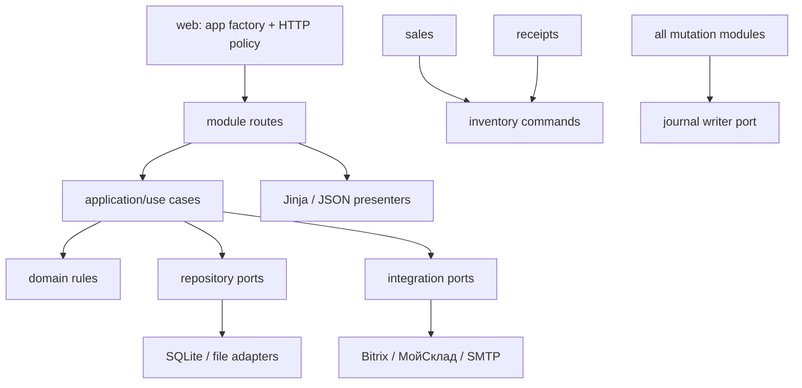

# Целевая архитектура

Статус: `proposed`. Это эволюция текущего Flask/Jinja modular monolith, а не
решение о переписывании. URL, JSON contracts и данные сохраняются до отдельных
одобренных изменений ([current state](current-state.md),
[ADR candidates](../decisions/README.md)).

```text
app/
├── web/                 # app factory, auth/CSRF, shared response adapters
├── catalog/             # routes, application, domain, repositories, presentation
├── inventory/           # stock commands, invariants, movement repository
├── sales/               # sales routes/use cases/domain/repositories/reporting
├── receipts/            # receipt routes/use cases/import adapters
├── repairs/             # routes/use cases/file repository/presentation
├── journal/             # query/write use cases and SQLite repository
├── auth/                # routes/use cases/store/session/mail adapters
├── integrations/        # bitrix/, moysklad/, future adapters
└── shared/              # explicit infrastructure and UI primitives only
```

Receipts is separate from Inventory because it has its own lifecycle, import and
UI; it depends on the Inventory command boundary for stock effects. Users/Roles
remain inside Auth until their lifecycle justifies a module. Analytics starts as
read models owned by Sales/Receipts/Catalog rather than a write domain.



## Rules of dependency

1. Routes depend on application use cases and presenters, never concrete SQL or
   external HTTP. Existing Flask endpoint names and URL rules remain stable.
2. Application coordinates domain rules and ports. It accepts dependencies at
   construction; it does not import `app.web` or Flask globals.
3. Domain rules are pure where practical and do not depend on Flask, SQLite,
   templates or clients.
4. Repository adapters own raw SQL/JSON locking and translate rows/files to
   stable application DTOs. Data migration requires its own plan and rollback.
5. Integration adapters own timeouts, retries, redaction, idempotency metadata
   and normalized errors. Application code decides compensation.
6. Presentation owns view-model/JSON shape. Jinja remains default; React is not
   introduced without an accepted ADR and a bounded business case.
7. Shared contains genuinely cross-cutting contracts, not domain dumping.
8. Cross-module reads use explicit query ports; mutations use application
   commands. No module imports another module's repository implementation.

## Module responsibilities

| Module | Routes/presentation | Application/domain | Repositories/models | Allowed dependencies / tests |
| --- | --- | --- | --- | --- |
| Catalog | Existing product/brand/category URLs and Jinja/API presenters | Product lifecycle, classification, mapping | Current catalog/ERP tables behind adapters | shared, integration ports; characterization from current catalog tests ([current code](../../app/catalog)) |
| Inventory | Existing stock and movement URLs | Adjust/reserve/release/apply receipt/sale invariants | products + movements in one transaction | catalog identity query, journal port; inventory tests ([service](../../app/services/sales_inventory.py)) |
| Sales | Existing sales/report routes and templates | Create/update/cancel/return/report query | sales/items adapter; stock only via Inventory | catalog query, inventory command, journal; sales contract tests |
| Receipts | Existing receipt/import routes/templates | Draft/post/update/cancel/import | receipt/items/draft adapters; stock via Inventory | catalog query, inventory, journal, MoySklad port |
| Repairs | Existing repair forms/APIs/template | lifecycle/actions/logistics/attachments policy | First retain JSON+file adapter; migration is separate | order query port, journal; current repair tests |
| Journal | Existing Jinja/API | Append immutable event and cursor query | audit event SQLite adapter | shared identity/time only; audit tests |
| Auth | Existing Blueprint/templates/CLI | registration/login/reset/invitation/roles | auth SQLite/session adapters | mail port and shared web security; auth tests |
| Integrations | No business routes | Adapter contracts only | external IDs and operation receipts | requests/logging/config; mock contract tests |
| Web/shared UI | App factory, auth/CSRF, response helpers, common partials/assets | No domain decisions | No domain storage | imports module route factories; layout/design tests |

## Evolution constraints

Each PR first locks behavior with characterization tests, then moves code with no
contract change. Old import paths may temporarily re-export functions. No mass
Jinja-to-React rewrite, no database migration, no URL rename and no public API
version removal are prerequisites. Rollback is the reverse commit because data
format and external contracts remain untouched. The staged plan is in
[roadmap](roadmap.md).
