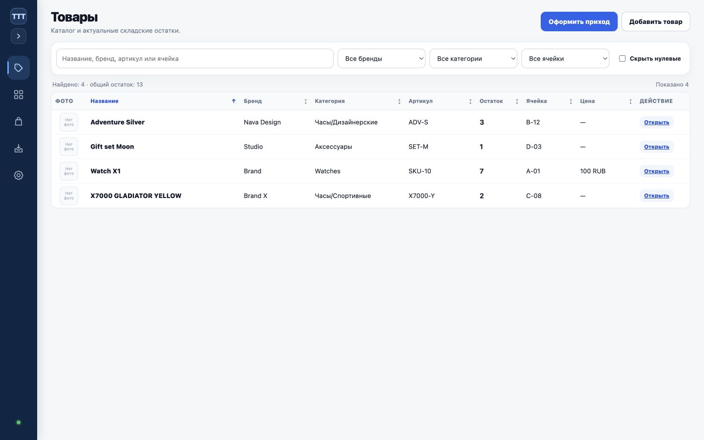
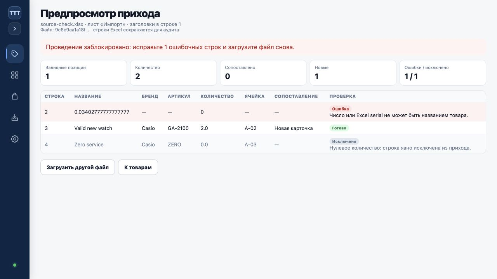

# Критическое исправление Products / Excel / прихода

## Первопричина

Batch `bitrix-excel-6a6e3f1127a5e077209a` был применён как полный набор
начальных Excel-остатков. Legacy-сервис создавал карточку для каждой строки и
сразу записывал целевой остаток и операцию корректировки. Такой batch не являлся
документом прихода и не требовал пользовательского подтверждения
«Оформить приход». Исходный файл уже содержал Excel serial
`0.034027777777777775` в колонке названия и date-label `28th of MAY` в колонке
бренда. Старый подготовительный скрипт читал первые шесть позиций без
семантической проверки типов, а batch-сервис принимал эти значения как текст.

## Безопасное восстановление production-данных

Batch создан `2026-07-22T11:49:28+00:00` (`14:49:28` МСК). Проверка показала:

- все 3313 рабочих Excel-карточки созданы этим batch, предыдущего состояния у
  них не было;
- 836 операций `initial_excel_adjustment` дали суммарно `+1912`;
- документа прихода для batch не существовало;
- 11 legacy-таблиц Bitrix-каталога и остальные JSON-хранилища совпадали с
  гарантированно чистой копией непосредственно до batch;
- последующих несвязанных складских записей в затронутых таблицах не было.

До восстановления создан полный backup:

`/var/backups/clock-erp/pre-critical-products-recovery-20260722T131142Z-8f1991d0fb24`

Размер — 374396669 байт (358 MiB), manifest содержит 21 файл, SHA-256 manifest:
`5a348cbcac44bce1503cff61de04defe39c5c87dba4c8c2f2370e16f23fcb7c0`.
Проверки manifest, SQLite `quick_check` и внешних ключей прошли.

Точечный транзакционный rollback выполнен штатной обратной операцией batch.
После него:

| Контроль | До | После |
| --- | ---: | ---: |
| Активные карточки batch | 3313 | 0 |
| Активный остаток batch | 1912 | 0 |
| Исходные операции | 836 / `+1912` | 836 / `+1912` |
| Обратные операции | 0 | 836 / `-1912` |
| Чистое движение batch | 1912 | 0 |
| Карточки с `0.034027777777777775` | 1 | 0 |

Batch сохранён в аудите со статусом `rolled_back`; его 3313 строк registry не
активны и не влияют на каталог. Legacy Bitrix-каталог остался равен контрольной
копии: 4684 товара, 28893 изображения, 80 sync runs. `quick_check: ok`, проверка
внешних ключей прошла. Записей в Bitrix и МойСклад не выполнялось.

## Новый сценарий

1. Кнопка «Оформить приход» открывает загрузку Excel.
2. «Проверить Excel» сохраняет исходный файл, SHA-256 и разобранные строки только
   во временный `catalog_excel_import_drafts`.
3. Заголовки определяются по названиям. Числовые названия допускаются только при
   наличии бренда или артикула. Excel-time для бренда `28th of MAY`
   нормализуется в `HH:MM`, а целые значения вида `1925.0` — в `1925`; исходное
   значение, формат ячейки и способ нормализации сохраняются в аудите.
4. Предпросмотр показывает исходную строку, позицию, количество, результат
   сопоставления и ошибку. До подтверждения рабочие карточки, остатки и операции
   не меняются.
5. Все 3313 товарных строк создают отдельные карточки. Для 2477 строк с нулевым
   остатком складские операции не создаются; 836 положительных строк создают
   836 операций на суммарные `+1912`.
6. Только отдельный POST «Оформить приход» повторно читает сохранённый файл и в
   одной SQLite-транзакции создаёт документ, 3313 строк прихода, карточки и 836
   операций остатков. Исключение на любой строке откатывает всё целиком.
7. `parser_version` безопасно пересобирает только непроведённый draft. SHA-256 и
   `draft_id` делают повторную загрузку и повторное подтверждение идемпотентными;
   rolled-back legacy batch и его audit history остаются неизменными.

Прямой CLI-apply Excel отключён. Скрипт создаёт только draft; legacy rollback
оставлен для аудита ранее применённых batch.

## Интерфейс `/products`

Основной экран снова предназначен для ежедневной работы: заголовок, две кнопки,
поиск, одна строка фильтров и таблица с фото, названием, брендом, категорией,
артикулом, остатком, ячейкой, ценой и действием. Batch registry, источник
остатков, XML_ID, дата импортированной строки и техническое сопоставление на
основном экране не показываются.

## Откат изменения кода

До merge/deploy достаточно закрыть Draft PR: production-код этим PR не менялся.
После будущего deploy код откатывается штатным `scripts/deploy.sh` на предыдущий
одобренный commit. Если потребуется отменить уже проведённый новый приход,
сначала остановить запись, создать свежий backup и восстановить `catalog.db` из
последней проверенной копии до документа; legacy `ExcelProductBatchService`
нельзя применять к новым receipt-операциям.

Production deploy нового кода этим изменением не выполнялся.

## Скриншоты

### Простой `/products`, desktop 1440 px

### Предпросмотр с блокирующей и исключённой строками

