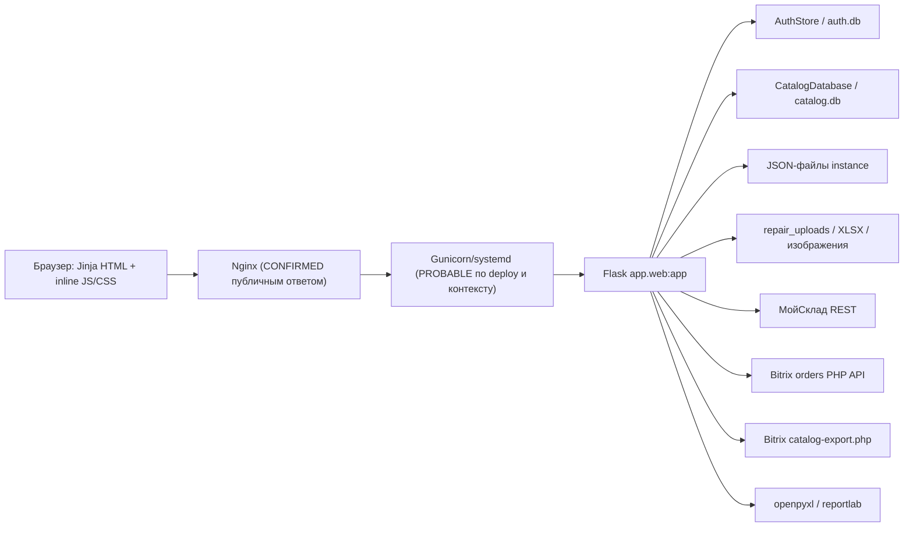
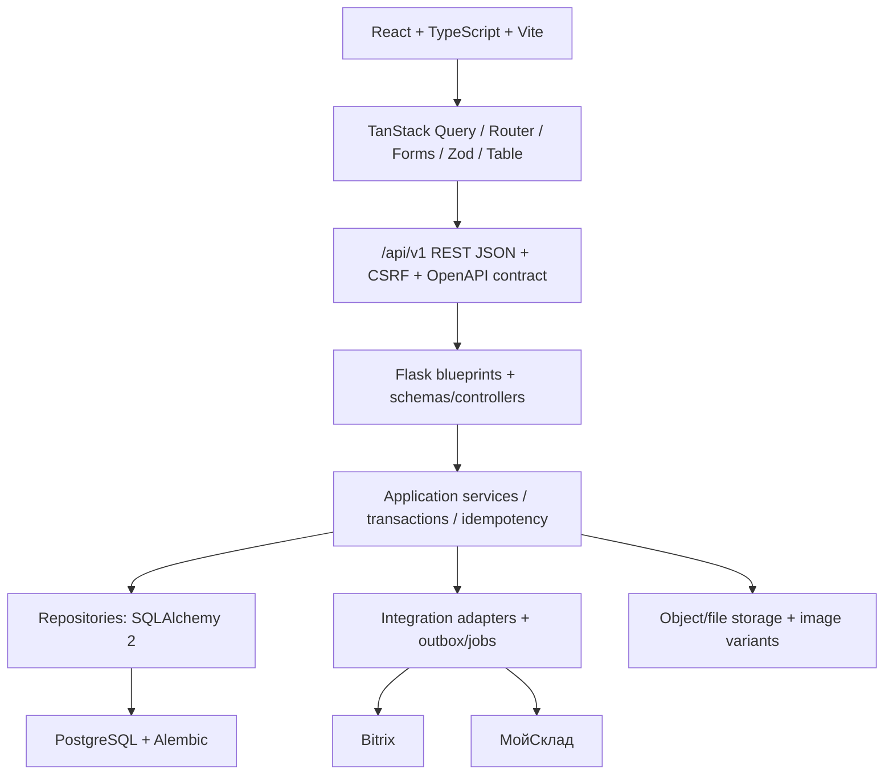

# Полный технический аудит Vechasu / Clock ERP перед React-переработкой

Дата аудита: 2026-07-29.

Baseline: `origin/main`, commit `22129883e6eac32c1ead0d0f23f8f0f1f1c2e6e1` (`Вернуть фильтр товаров в наличии (#110)`).

Режим: только чтение кода и данных, безопасные локальные проверки, один публичный HTTP-запрос без авторизации. Production, зависимости и прикладной код не изменялись.

Статусы: `CONFIRMED` — подтверждено кодом/конфигурацией; `PROBABLE` — сильные косвенные признаки; `UNKNOWN` — данных нет; `BLOCKED` — нужна запрещённая или потенциально изменяющая проверка.

## 1. Executive summary

1. `CONFIRMED` — система является Flask-монолитом с Jinja и обычным JavaScript. Главная точка приложения — `app/web.py:87-11964`; в этом же файле находятся 11 964 строки маршрутов, бизнес-логики, файлового хранения, интеграций и генерации отчётов. Это основной источник риска переработки.
2. `CONFIRMED` — фактический слой данных смешанный: две SQLite-базы, JSON-файлы, файловые вложения и внешние сущности Bitrix/МойСклад. Единого источника истины нет (`app/catalog_db.py:8-787`, `app/auth.py:88-509`, `app/web.py:137-145, 765-1351, 2652-3535, 4129-5415, 7702-8365`).
3. `CONFIRMED` — PostgreSQL и Alembic отсутствуют; схема создаётся и местами изменяется при обычном запуске через SQL DDL/`PRAGMA` (`app/catalog_db.py:11-577, 580-787`, `app/auth.py:138-177`). Перед PostgreSQL нужен отдельный слой repository/ORM и повторяемая сверяемая миграция.
4. `CONFIRMED` — React можно вводить постепенно, сохранив Flask. Смена Flask сейчас не даёт выгоды, сопоставимой со стоимостью одновременного переноса 68 маршрутов, интеграций и бизнес-логики. Рекомендация: Flask + versioned REST API + service/repository layer + SQLAlchemy 2 + Alembic, затем React/Vite.
5. `CONFIRMED` — критический security-риск: в Git хранится строковый токен обновления статуса заказа (`app/web.py:145, 456-464`). Значение в аудит намеренно не приводится. Требуются удаление из кода, ротация и secret storage до публичного API.
6. `CONFIRMED` — CSRF проверяется точечно, но отсутствует у 21 изменяющего POST-маршрута, включая заказы, склад, часть продаж, приходов и товаров (`app/auth.py:520-541`; сопоставление маршрутов `app/web.py:526-2650, 5840-5984, 8793-10823, 11236-11517`).
7. `CONFIRMED` — все авторизованные сотрудники получают доступ почти ко всем прикладным операциям; `admin_required` применяется только к приглашениям. Мультитенантности и company isolation нет (`app/auth.py:548-577, 810-864, 880-923`).
8. `CONFIRMED` — в `web.py` есть переопределённые функции и крупные недостижимые legacy-блоки после `return`; это создаёт риск неверно перенести неисполняемое поведение (`app/web.py:1799-1850, 1908-1983, 2003-2228, 2571-2650, 2610-3535`).
9. `CONFIRMED` — UI сильно связан с Jinja/DOM: шесть крупнейших шаблонов содержат тысячи строк inline CSS/JS. Частичная общая дизайн-система уже есть в `app/static/css/erp-components.css`, `themes.css`, sidebar и combobox; её визуальные токены нужно сначала зафиксировать, а не переизобретать.
10. `CONFIRMED` — безопасный тестовый прогон baseline: 347 тестов, 339 успешно, 4 пропущено, 4 ошибки окружения. Три ошибки вызваны отсутствием установленного `reportlab`, одна — запретом локального socket bind в sandbox. Последние GitHub Actions для соответствующего PR и push успешны; измерения line/branch coverage нет.
11. `CONFIRMED` — public read-only проверка `https://sklad.tictactoy.ru/login` вернула HTTP 200 и `nginx/1.20.1`, cookie `Secure; HttpOnly; SameSite=Lax`. В ответе не обнаружены CSP/HSTS/X-Frame-Options/Permissions-Policy/Referrer-Policy. Содержимое cookie не сохранялось.
12. `BLOCKED` — ОС, Python/Gunicorn, systemd unit, worker count, права, фактические production-данные, backups и восстановление не проверялись: SSH и изменение production запрещены условиями задачи.

Решение go/no-go: начинать перенос страниц рано. Сначала обязательны security containment, characterization tests, data ownership map, API contracts, production snapshot/restore rehearsal и визуальные эталоны.

## 2. Фактическая архитектура



Запросы синхронные. Очереди, scheduler и отдельные workers отсутствуют. Локальные in-process caches не согласуются между Gunicorn workers.

### Точки запуска

| Статус | Точка | Назначение и доказательство |
|---|---|---|
| `CONFIRMED` | `app.web:app` | Flask app создаётся в `app/web.py:87-100`; production scripts проверяют `app.web` (`scripts/deploy.sh:204-230`). |
| `CONFIRMED` | `python app/web.py` | Development server `127.0.0.1:5050`, `debug=True` (`app/web.py:11963-11964`). |
| `CONFIRMED` | `python app/main.py` | Только вызывает legacy `check_connection()`, не запускает ERP (`app/main.py:1-5`). |
| `CONFIRMED` | Flask CLI | Импорт/синхронизация каталога регистрируются в `app/web.py:11471-11480` и service/command modules. |
| `UNKNOWN` | Gunicorn command | unit/config не хранятся в Git; точная команда и workers недоступны. |
| `CONFIRMED` | `app/init__.py`, `app/sync.py`, `README.md` | Пустые файлы; функциональными entry points не являются. |

## 3. Полная структура и назначение репозитория

```text
.github/                 issue/PR templates, workflow Tests
app/
  auth.py                users, invitations, sessions, CSRF, rate limiting
  catalog_db.py          SQLite DDL, connection, ad-hoc schema upgrades
  config.py              env configuration
  main.py                legacy Bitrix connection diagnostic
  web.py                 Flask app, routes, business/UI orchestration
  clients/               Bitrix orders/catalog/exchange and MoySklad clients
  services/              catalog/import/repair/sales business services
  data/                   Russian locations JSON
  static/css|js/          shared CSS and vanilla-JS components
  templates/              Jinja pages and partials
bitrix/                   PHP catalog export endpoint deployed on Bitrix side
docs/                     prior audits, runbooks, screenshots
instance/                 runtime data (ignored, but two reference JSON tracked)
scripts/                  imports, repair jobs, diagnostics, deploy/auth scripts
tests/                    36 unittest modules, optional browser tests
requirements.txt          Python runtime dependencies
.env.example              environment contract
.gitignore                exclusions
type                      empty accidental tracked file
```

### Модули приложения

| Группа | Файлы | Назначение |
|---|---|---|
| Core | `app/web.py`, `auth.py`, `catalog_db.py`, `config.py` | app lifecycle, routes, auth, schema/config |
| Clients | `clients/bitrix.py`, `bitrix_orders.py`, `bitrix_catalog.py`, `moysklad.py` | REST/legacy API access |
| Bitrix catalog | `services/bitrix_catalog_importer.py`, `bitrix_erp_product_sync.py`, `catalog_reader.py`, `catalog_data_quality.py` | normalisation, import, read model, quality |
| Excel products | `excel_product_catalog.py`, `excel_receipt_import.py`, `product_*`, `brand_values.py`, `numeric_brand_repair.py` | product master, classification, drafts, receipts, repair |
| Operations | `sales_inventory.py`, `repair_cases.py`, `legacy_repair_import.py` | atomic local sales/stock, repair workspace and migration |
| Mapping | `moysklad_catalog_mapping.py`, `product_reconciliation.py` | external-ID reconciliation |

Полный перечень изученных source/config файлов приведён в приложении A; функциональное назначение шаблонов и static-файлов — в `full-react-rewrite-ui-map.md`.

### CLI и скрипты

| Файл | Назначение | Режим/риск |
|---|---|---|
| `scripts/*bitrix*`, `sync_bitrix_products.py` | dry-run, import, sync, server diagnostic | часть пишет SQLite/Bitrix-side; запускать только по отдельному runbook |
| `apply_excel_product_catalog.py` | применяет Excel catalog batch | меняет данные |
| `catalog_data_quality_audit.py` | read-oriented quality report | безопасен с read-only копией |
| `cleanup_empty_catalog_properties.py` | удаляет пустые свойства | destructive |
| `import_legacy_repairs.py`, `migrate_repair_cases.py` | migration repair JSON | меняет runtime files |
| `repair_numeric_brands.py`, `repair_product_classification.py` | data repair | меняет SQLite |
| `reconcile_bitrix_excel_catalog.py` | сопоставление каталогов | возможны записи |
| `import_tictactoy_locations.py` | получает/создаёт location dataset | network + file write |
| `deploy.sh` | backup, update, checks, restart, rollback | production-changing |
| `enable_app_auth.sh` | меняет Nginx auth config и reload | production-changing |

`CONFIRMED` — автоматических cron/systemd timer/Celery/RQ задач в репозитории нет (`docs/bitrix_catalog_sync.md:76-105`); каталог синхронизируется вручную CLI. Фактические server timers — `BLOCKED`.

## 4. Реестр технологий и версий

| Область | Факт | Статус |
|---|---|---|
| Python | локальный venv: 3.9.6; CI: 3.10 | `CONFIRMED`, production `UNKNOWN` |
| Flask | локально 3.1.3; `requirements.txt` не pin | `CONFIRMED` локально |
| Werkzeug/Jinja/Click | 3.1.8 / 3.1.6 / 8.1.8 локально; transitively installed | `CONFIRMED` локально |
| requests | 2.32.5 локально; не pin | `CONFIRMED` |
| openpyxl | 3.0.10 pin и локально | `CONFIRMED` |
| reportlab | 3.5.68 pin; отсутствует в текущем venv | `CONFIRMED` |
| SQLite | stdlib `sqlite3`; user_version=0 | `CONFIRMED` |
| Frontend | HTML/Jinja, CSS, vanilla JS; npm/package.json отсутствуют | `CONFIRMED` |
| Tests | stdlib `unittest`; optional Selenium/browser harnesses | `CONFIRMED` |
| CI | GitHub Actions, Ubuntu, Python 3.10 | `CONFIRMED`, `.github/workflows/tests.yml:1-63` |
| Production edge | Nginx 1.20.1 | `CONFIRMED` публичным HTTP 200 2026-07-29 |
| Gunicorn/systemd | заявлены контекстом/deploy | `PROBABLE`; configs `BLOCKED` |

Неполная фиксация зависимостей делает сборки нерепродуцируемыми. `gunicorn` не указан в `requirements.txt`. Установка/обновление зависимостей в рамках аудита не выполнялась.

### Переменные окружения

Без значений: `MOYSKLAD_TOKEN`, `BITRIX_WEBHOOK_URL`, `BITRIX_REST_URL`, `BITRIX_ORDERS_URL`, `BITRIX_ORDER_URL`, `BITRIX_API_MAX_RETRIES`, `BITRIX_LOGIN`, `BITRIX_PASSWORD`, `BITRIX_EXCHANGE_URL`, `BITRIX_CATALOG_URL`, `BITRIX_CATALOG_TOKEN`, `ERP_SECRET_KEY`, `ERP_SESSION_COOKIE_SECURE`, `ERP_AUTH_DATABASE` (`.env.example:1-14`). Дополнительно код читает `CATALOG_DATABASE_PATH`, `BITRIX_ORDERS_TOKEN`, диагностический `BITRIX_DOCUMENT_ROOT`; они отсутствуют в `.env.example`.

## 5. Реестр функций, страниц, routes и шаблонов

Полная матрица поведения: `full-react-rewrite-feature-matrix.md`; UI: `full-react-rewrite-ui-map.md`; будущий API: `full-react-rewrite-api-map.md`.

### Все Flask routes

| URL и методы | Функция, строки | UI/ответ | Состояние |
|---|---|---|---|
| `GET,POST /register` | `register`, `auth.py:632-716` | `register.html` | регистрация по первому admin/приглашению |
| `POST /register/invitation` | `accept_invitation`, `auth.py:720-744` | JSON | проверка токена приглашения |
| `GET /register/success` | `registration_success`, `auth.py:748-754` | success page | public |
| `GET,POST /login`; `POST /logout` | `auth.py:758-805` | login/redirect | rate limit + CSRF |
| `POST /settings/invitations`; `POST /settings/invitations/<id>/revoke` | `auth.py:810-864` | partial/redirect | admin only |
| `GET /`; `GET /order/<id>` | `index`, `order_page`, `web.py:484-520` | `orders.html` | Bitrix orders/detail |
| `POST /order/<id>/stock-writeoff`; `/product-map`; `/status` | `web.py:526-753` | redirect | external/local writes; CSRF missing |
| `GET /warehouse`; exports/detail/thumbnail | `web.py:1353-1758` | `warehouse.html`, XLSX/PDF/JSON/image | local catalog + proxied images |
| 7 warehouse POST routes | `web.py:1764-2650` | redirect | category/cell/add/edit/bulk/stock/archive; CSRF missing |
| `GET /repair`; 6 repair writes; attachment | `web.py:3537-4078` | `repair.html`/file | JSON + uploads, CSRF present |
| `GET /stock-operations` | `web.py:4083-4127` | `stock_operations.html` | local journal |
| 7 sales POST routes | `web.py:5417-6310` | redirect | mixed JSON/SQLite; two miss CSRF |
| `GET /sales/report[.xlsx|.pdf]` | `web.py:7209-7700` | page/download | synchronous aggregation/export |
| `GET /sales` | `web.py:8111-8234` | `sales.html` | merged sources |
| `POST /receipts/catalog/create` | `web.py:8367-8621` | redirect | local catalog sale-reverse flow, CSRF |
| `GET /receipts`; `GET /receipts/report` | `web.py:8625-8760` | pages | legacy MoySklad receipts |
| preview/create/update/delete receipt | `web.py:8793-10823` | redirect | Excel + MoySklad; CSRF missing except catalog/create |
| `GET /analytics` | `web.py:11056-11067` | `analytics.html` | Python aggregation |
| `/products` and product/receipt routes | `web.py:11165-11351` | partial + four pages | local SQLite; all POST lack CSRF |
| catalog list/detail/import/mapping | `web.py:11355-11517` | 4 pages/redirect | Bitrix SQLite + live import/mapping |
| `GET,POST /settings`; nav toggle | `web.py:11862-11960` | `settings.html` | any employee; CSRF present |

Всего: 68 явно объявленных route rules, из них 41 POST-capable и 30 GET-capable (три GET/POST rules учитываются в обеих категориях), плюс автоматически создаваемый Flask static rule `/static/<path:filename>`. Отдельных routes для brands, categories, clients, companies, users/roles и CDEK нет: это поля, справочники или отсутствующие функции, а не скрытые страницы.

### Templates, CSS и JavaScript

| Тип | Факт |
|---|---|
| Общая оболочка | `_sidebar.html`, `_navigation_icons.html`; большинство прикладных страниц — самостоятельные full HTML, а не наследники единого base |
| Auth | `auth_base.html`, `login.html`, `register.html`, success/invitation partial |
| Products/catalog | 11 templates/partials для Excel product master, receipt draft и Bitrix catalog |
| Operations | `orders.html`, `warehouse.html`, `sales.html`, `receipts.html`, `repair.html`, reports/analytics/journal/settings |
| Shared CSS | `erp-components.css` (3007 строк), `themes.css` (1384), `sidebar.css` (669), combobox (264), `style.css` (15) |
| Shared JS | combobox (505), period picker (392), sidebar (311), theme (157) |
| Inline debt | `warehouse.html` 6696 строк, `sales.html` 6333, `receipts.html` 4545, `orders.html` 1800, `repair.html` 1406; CSS и DOM handlers тесно связаны с markup |

## 6. Бизнес-логика

| Процесс | Реализация/модели | Валидация и транзакции | Риски |
|---|---|---|---|
| Bitrix orders | `web.py:350-753`, `clients/bitrix_orders.py:1-339` | form parsing, synchronous HTTP | web использует legacy helpers вместо read-only client; status token в коде; no CSRF |
| Order write-off | `order_stock_writeoff`, `web.py:526-672`; MoySklad loss + `stock_operations.json` | pre-check local journal, затем цикл external writes | неатомарно; частичный write-off; нет idempotency key |
| Warehouse browse | `warehouse_page`, `web.py:1353-1579`; `ExcelProductCatalog.list_products:644-873` | server pagination and sort whitelist | facets/LIKE scans; export up to 100k in RAM |
| Warehouse edits | `web.py:1764-2650`; local SQLite/JSON | route-local validation | CSRF absent; legacy external code after return вводит в заблуждение |
| Sales | `web.py:4129-8365`; `SalesInventory:1-453` | SQLite `BEGIN IMMEDIATE`, conditional stock decrement | три источника sales (DB/manual JSON/derived operations), merge/duplicate risk |
| Returns | `SalesInventory.return_sale`, `web.py:6265-6310` | atomic DB update + movement | local-only; внешние системы не участвуют |
| Legacy receipts | `web.py:8367-10823`, `clients/moysklad.py` | form validation, sequential external/local changes | partial failure and drift; no global transaction/idempotency |
| New Excel receipts | `ExcelReceiptImportService`, `web.py:11231-11285` | draft/post in SQLite transaction, file hash unique | отдельный параллельный receipt subsystem; external sync absent |
| Repairs | `RepairCaseStore`, `web.py:3230-4078` | JSON lock/atomic replace in service; form validation | extension-only file validation; PII/files; no DB FK |
| Bitrix catalog import | client/importer/reader + catalog routes | per-run transaction and payload hashes | live import preview в GET; synchronous, schema init on reads |
| Product matching/classification | reconciliation/classification/repair services | audits and reversible records частично | business rules distributed across scripts/services/UI |
| Reports/analytics | `web.py:6312-8110, 10825-11067` | Python aggregation, openpyxl/reportlab | all-record loading, slow/high memory |
| Settings/navigation | `web.py:11519-11960` | JSON write + CSRF | settings доступны employee; company fields are not tenancy |

### Конкретный technical debt

- `CONFIRMED` — `load_warehouse_cells`, `save_warehouse_cells`, `set_warehouse_cell`, category helpers и `get_warehouse_items` переопределяются позднее в том же модуле (`app/web.py:765-1351, 2652-3535`). Исполняется последняя версия.
- `CONFIRMED` — после unconditional `return` остаются старые MoySklad implementations в `warehouse_update_cell`, `warehouse_edit_product`, `warehouse_bulk_edit`, `warehouse_archive_product` (`app/web.py:1799-1850, 1908-1983, 2003-2228, 2571-2650`).
- `CONFIRMED` — чтение `get_warehouse_items` может обновлять `warehouse_cells.json`; GET имеет побочный эффект (`app/web.py:2683-3535`).
- `CONFIRMED` — direct JSON overwrites без единого lock/transaction присутствуют для mappings, operations, sales overrides/manual sales, receipts/settings; параллельные workers могут потерять обновление (`app/web.py:137-144, 765-1351, 4129-5415, 7702-8365, 11519-11960`).
- `CONFIRMED` — Jinja/JS выполняет display filtering, column settings, modal state, computed totals и формирует FormData; часть поведения является фактической бизнес-логикой UI (`sales.html:2576-6333`, `receipts.html:2547-4545`, `warehouse.html:4848-6696`).

До API-переноса каждое write-flow нужно вынести в service с явными command DTO, транзакционной границей и idempotency.

## 7. Данные и база

### Фактическое хранение

| Store | Путь | Содержимое |
|---|---|---|
| SQLite | `instance/catalog.db` или `CATALOG_DATABASE_PATH` | Bitrix catalog, Excel products/receipts, mappings, sales, stock movements |
| SQLite | `instance/auth.db` или `ERP_AUTH_DATABASE` | users, invitations, attempts |
| JSON | `instance/*.json` | navigation, settings/company label, mappings, sales/receipt overrides, cells, stock journal, repairs |
| Files | `instance/repair_uploads`, SQLite BLOB | repair attachments; uploaded Excel draft source |
| External | Bitrix, MoySklad | orders/catalog and documents/products/stock |

Локальная read-only проверка обеих SQLite: `PRAGMA quick_check=ok`, `PRAGMA user_version=0`; все 29 таблиц локальной копии пусты. Это не production counts. Небольшие локальные JSON содержали тестовые/рабочие записи, значения и идентификаторы в отчёт не включены.

### Data dictionary

Обозначения: `PK`, `FK`, `UQ`; остальные поля nullable, если явно не обозначено `!`. Полные DDL находятся в `app/catalog_db.py:11-577` и `app/auth.py:138-177`.

| Таблица | Колонки |
|---|---|
| `catalog_categories` | `id PK`, `external_source!`, `external_category_id!`, `external_xml_id`, `code`, `name!`, `parent_id FK`, `sort!`, `active!`, `path_json!`, timestamps; `UQ(source,id)` |
| `catalog_products` | `id PK`, name/slug/article/barcode/brand/texts/formats, `active!`, `primary_category_id FK`, source/external ids/times, `payload_hash!`, `normalized_payload_json!`, sync timestamps/mode; `UQ(external_source,external_product_id)` |
| `catalog_product_categories` | `product_id PK/FK`, `category_id PK/FK`, `is_primary!`, `sort!` |
| `catalog_properties` | `id PK`, external source/id, code/name/type/multiple/sort/timestamps; source/id unique |
| `catalog_product_property_values` | `id PK`, product/property FK, value/display/enum JSON, sort; pair unique |
| `catalog_offers` | `id PK`, product FK, external source/id/xml, code/name/article/barcode/active/external time, payload JSON/hash/timestamps; source/id unique |
| `catalog_offer_property_values` | `id PK`, offer/property FK, value/display/enum JSON, sort; pair unique |
| `catalog_images` | `id PK`, product/offer FK, external metadata, URL/file/mime/dimensions/size/sort/primary/timestamps |
| `catalog_prices` | `id PK`, product/offer FK, external metadata, type/name, amount/currency/base/old amount/timestamps |
| `catalog_moysklad_mappings` | `id PK`, `product_id FK/UQ`, `moysklad_product_id UQ`, match metadata/confirmed/timestamps |
| `catalog_sync_runs` | `id PK`, mode/status/times/cursors/counters/error/details JSON |
| `catalog_excel_batches` | `id PK`, hash/file/sheet/source/operation/counts/stock/status, previous batch FK, sync status/times/details JSON |
| `catalog_excel_products` | `id PK`, source/batch FKs, active/raw JSON/Excel identity/article/brand/category/stock/cell, match metadata/candidates JSON, Bitrix link+snapshot/gallery/properties, sync status/timestamps; source_key unique |
| `catalog_product_classification_audit` | `id PK`, run/product FKs, status/reason/old-new brand/category/time |
| `catalog_excel_batch_rows` | `id PK`, batch/product FK, source/row/kind/previous+applied JSON, stock delta, link/result/time; batch/source unique |
| `catalog_excel_stock_operations` | `id PK`, batch/product/reversal FK, type/stock delta/time/details JSON |
| `catalog_excel_match_audit` | `id PK`, product/batch/reversal FK, action/states JSON/time |
| `catalog_excel_import_drafts` | `id PK`, file hash/name/BLOB/sheet/header/parser/status/counters/quantity/times/details; file hash unique |
| `catalog_excel_import_draft_rows` | `id PK`, draft/catalog-product FK, row/status/raw+data JSON/error/match/candidates; draft/row unique |
| `catalog_excel_receipts` | `id PK`, number/draft FK/file hash/sheet/status/counters/quantity/times/details; number/draft/hash unique |
| `catalog_excel_receipt_rows` | `id PK`, receipt/draft-row/product/Bitrix-product FK, Excel fields/cell/quantity/stock/flags/match/time; receipt/draft-row unique |
| `catalog_excel_receipt_operations` | `id PK`, receipt/row/product FK, stock delta/time/details; receipt-row unique |
| `catalog_excel_manual_stock_operations` | `id PK`, product FK, stock delta/reason/time |
| `erp_sales` | `id PK`, source/status/times/return reason/user/metadata JSON/inserted/updated |
| `erp_sale_items` | `id PK`, sale/product FK, quantity/unit price/returned quantity/status/times/reason |
| `catalog_stock_movements` | `id PK`, product/sale/item FK, type/delta/stock/source/user/comment/time |
| `users` | `id PK`, names/email, `email_normalized UQ`, password hash, role, active, created epoch |
| `invitations` | `id PK`, `token_hash UQ`, email/normalized, role/expiry/state, creator/user FK, timestamps |
| `auth_attempts` | `id PK`, bucket, attempted epoch |

Индексы покрывают внешние идентификаторы, product listing facets, sale/movement time/status и receipt/draft relations (`app/catalog_db.py:11-577`, `auth.py:138-177`). Потенциально дорогими остаются leading-wildcard search, `lower/trim`, concatenated fields, JSON-text predicates и category aggregates; они требуют production `EXPLAIN ANALYZE`, сейчас `BLOCKED`.

### ER-схема

```mermaid
erDiagram
    USERS ||--o{ INVITATIONS : creates_uses
    CATALOG_CATEGORIES ||--o{ CATALOG_CATEGORIES : parent
    CATALOG_CATEGORIES ||--o{ CATALOG_PRODUCTS : primary
    CATALOG_PRODUCTS ||--o{ CATALOG_PRODUCT_CATEGORIES : classified
    CATALOG_CATEGORIES ||--o{ CATALOG_PRODUCT_CATEGORIES : contains
    CATALOG_PRODUCTS ||--o{ CATALOG_PRODUCT_PROPERTY_VALUES : has
    CATALOG_PROPERTIES ||--o{ CATALOG_PRODUCT_PROPERTY_VALUES : defines
    CATALOG_PRODUCTS ||--o{ CATALOG_OFFERS : has
    CATALOG_OFFERS ||--o{ CATALOG_OFFER_PROPERTY_VALUES : has
    CATALOG_PROPERTIES ||--o{ CATALOG_OFFER_PROPERTY_VALUES : defines
    CATALOG_PRODUCTS ||--o{ CATALOG_IMAGES : has
    CATALOG_OFFERS ||--o{ CATALOG_IMAGES : has
    CATALOG_PRODUCTS ||--o{ CATALOG_PRICES : has
    CATALOG_OFFERS ||--o{ CATALOG_PRICES : has
    CATALOG_PRODUCTS ||--o| CATALOG_MOYSKLAD_MAPPINGS : maps
    CATALOG_EXCEL_BATCHES ||--o{ CATALOG_EXCEL_PRODUCTS : creates_updates
    CATALOG_PRODUCTS ||--o{ CATALOG_EXCEL_PRODUCTS : bitrix_match
    CATALOG_EXCEL_BATCHES ||--o{ CATALOG_EXCEL_BATCH_ROWS : logs
    CATALOG_EXCEL_PRODUCTS ||--o{ CATALOG_EXCEL_BATCH_ROWS : affected
    CATALOG_EXCEL_BATCHES ||--o{ CATALOG_EXCEL_STOCK_OPERATIONS : logs
    CATALOG_EXCEL_PRODUCTS ||--o{ CATALOG_EXCEL_STOCK_OPERATIONS : affected
    CATALOG_EXCEL_PRODUCTS ||--o{ CATALOG_EXCEL_MATCH_AUDIT : audited
    CATALOG_EXCEL_IMPORT_DRAFTS ||--o{ CATALOG_EXCEL_IMPORT_DRAFT_ROWS : parses
    CATALOG_PRODUCTS ||--o{ CATALOG_EXCEL_IMPORT_DRAFT_ROWS : candidate
    CATALOG_EXCEL_IMPORT_DRAFTS ||--o| CATALOG_EXCEL_RECEIPTS : posts
    CATALOG_EXCEL_RECEIPTS ||--o{ CATALOG_EXCEL_RECEIPT_ROWS : contains
    CATALOG_EXCEL_PRODUCTS ||--o{ CATALOG_EXCEL_RECEIPT_ROWS : receives
    CATALOG_EXCEL_RECEIPT_ROWS ||--|| CATALOG_EXCEL_RECEIPT_OPERATIONS : applies
    CATALOG_EXCEL_PRODUCTS ||--o{ CATALOG_EXCEL_MANUAL_STOCK_OPERATIONS : adjusts
    CATALOG_EXCEL_PRODUCTS ||--o{ ERP_SALE_ITEMS : sold
    ERP_SALES ||--o{ ERP_SALE_ITEMS : contains
    CATALOG_EXCEL_PRODUCTS ||--o{ CATALOG_STOCK_MOVEMENTS : moves
    ERP_SALES ||--o{ CATALOG_STOCK_MOVEMENTS : causes
    ERP_SALE_ITEMS ||--o{ CATALOG_STOCK_MOVEMENTS : causes
```



### PostgreSQL incompatibilities and migration risks

- SQLite-specific: `PRAGMA`, `BEGIN IMMEDIATE`, `last_insert_rowid()`, `COLLATE NOCASE`, `GLOB`, `GROUP_CONCAT`, `char(31)`, `INSERT OR REPLACE`, `?` placeholders and runtime table rebuilds (`catalog_db.py:580-787`, `excel_product_catalog.py:414, 671-873, 936`, `sales_inventory.py:161`).
- `REAL` используется для денег/остатков. В PostgreSQL нужны domain/`numeric` с согласованным scale; до миграции требуется сравнение денежных итогов и stock deltas.
- timestamps хранятся как неоднородный `TEXT` или epoch `INTEGER`; нужны UTC `timestamptz` и однозначные parsing rules.
- JSON хранится в `TEXT`; миграция в `jsonb` требует валидировать каждую строку и определить индексируемые поля.
- `BLOB` исходного Excel увеличивает DB/backup; решить retention и object storage до миграции.
- Нет schema version history; Alembic baseline должен быть создан от подтверждённой production schema, а не только текущего DDL.
- Runtime schema mutation должна быть полностью отключена после Alembic.

## 8. Авторизация и безопасность

| Область | Вывод и доказательство | Статус/приоритет |
|---|---|---|
| Passwords | Werkzeug PBKDF2-SHA256, 600k iterations, длина 8–128 и common-password denylist (`auth.py:51-86, 180-206`) | `CONFIRMED`, medium |
| Sessions | signed Flask client cookie, 12h permanent lifetime, secret env или generated file mode 0600; Secure/HttpOnly/Lax (`auth.py:88-118, 880-899`) | `CONFIRMED`; rotation/idle/session revoke отсутствуют |
| Login abuse | SQLite rate limit keyed by SHA-256 bucket, 15-minute windows (`auth.py:207-251, 758-798`) | `CONFIRMED`; per-worker okay due DB, proxy trust requires review |
| Proxy | `ProxyFix(x_for=1,x_proto=1,x_host=1)` (`web.py:88-93`) | `CONFIRMED`; правильность trusted proxy chain `BLOCKED` |
| Redirect | next URL допускается только local path (`auth.py:578-594`) | `CONFIRMED` protected |
| Roles | только `employee/admin`; admin enforced только invitations (`auth.py:548-577, 810-864`) | `CONFIRMED`, high authorization gap |
| Company isolation | company fields — JSON settings, company_id/tenant FK нет | `CONFIRMED` absent |
| CSRF | custom session token and constant-time compare (`auth.py:520-541`), but 21 write routes do not call it | `CONFIRMED`, critical |
| CORS | config/headers absent | `CONFIRMED`; same-origin only |
| Security headers | public `/login` lacks CSP/HSTS/frame/referrer/permissions headers | `CONFIRMED`, high |
| SQL injection | parameters and sort allowlists used in inspected repositories | `CONFIRMED` no obvious exploit; dynamic SQL audit remains required |
| XSS | Jinja autoescape; catalog `safe` follows custom allowlist sanitizer (`catalog_reader.py:10-55`); JS escapes dynamic repair HTML | `PROBABLE` contained, custom sanitizer needs fuzz tests |
| Uploads | product images magic-check JPEG/PNG, 3 MB (`web.py:9511-9555`); Excel 15 MB/extension/openpyxl read-only; repair allows extensions only, 6×10 MB (`web.py:3400-3507`) | repair risk high; no antivirus/global request cap |
| IDOR | authentication protects routes, but every employee can address any ID; attachment membership is checked (`web.py:4044-4078`) | `CONFIRMED`, high |
| SSRF | remote image URLs originate from configured integrations, not arbitrary direct URL parameter; thumbnail proxies external URLs | `PROBABLE` bounded, allowlist still needed |
| Secrets | hard-coded order status token in Git; legacy clients can print response bodies (`web.py:145, 456-464`; `clients/bitrix.py:1-21`; `clients/moysklad.py:1-781`) | `CONFIRMED`, critical |
| Debug | direct-run `debug=True` | `CONFIRMED`; production use `UNKNOWN` |
| PII/logs | repair/order/sales/customer data; response-body prints may leak it | `PROBABLE`, high |

CSRF-missing route groups: order writes (3), warehouse writes (7), sales manual delete/status (2), legacy receipt preview/create/update/delete (4), product receipt preview/post + product delete/match (4), catalog mapping confirm (1).

### React SPA authentication

Сохранить same-origin deployment. React обращается к `/api/v1`; Flask сохраняет `Secure; HttpOnly; SameSite=Lax` session cookie. Добавить `/api/v1/auth/session`/`csrf`, CSRF token в memory и заголовок `X-CSRF-Token` для всех unsafe methods, global middleware enforcement, JSON 401/403 и session renewal/revoke. Не хранить долгоживущий bearer/JWT в `localStorage`. Cross-origin deployment не нужен; если станет обязательным — строгий origin allowlist, credentials и preflight tests, без wildcard.

## 9. Интеграции

| Сервис | Код/endpoints/auth | Поведение | Надёжность |
|---|---|---|---|
| МойСклад | `clients/moysklad.py:1-781`, base `api.moysklad.ru/api/remap/1.2`, Bearer | products/folders/images/attributes, stock, loss, enter, organization/store; GET/POST/PUT/DELETE | timeout 8s; retry/idempotency отсутствуют; response-body printing |
| Bitrix orders legacy | `web.py:350-464`, public project PHP endpoints | list/detail GET, status POST | hardcoded URLs/token; synchronous; no retry; write |
| Bitrix orders read-only | `clients/bitrix_orders.py:1-339` | configurable GET with HTTPS/retry/timeouts | production web его не использует |
| Bitrix catalog | `clients/bitrix_catalog.py:1-461`, `bitrix/catalog-export.php:1-end` | Bearer GET pages, import to SQLite | 429/5xx retry, pagination≤200; manual run |
| Bitrix exchange legacy | `clients/bitrix.py:1-21`, `main.py:1-5` | Basic auth `checkauth` | no timeout, prints response |
| Excel | `excel_receipt_import.py`, `excel_product_catalog.py`, `web.py:8793-9503` | xlsx/xlsm import, XLSX exports | two competing receipt workflows; 15 MB, up to 5000 rows in legacy preview |
| PDF | `web.py:1640-1714, 7408-7700` | warehouse/sales reportlab exports | synchronous, environment dependency |
| Images/files | MoySklad image API, Bitrix URLs, repair local files | upload/proxy/gallery | no image optimisation pipeline/object storage/virus scan |
| CDEK | free-text carrier/reference only | no API client/auth/sync | `CONFIRMED` not integrated |
| Email | emails stored for users/orders/customers | no outbound provider/client | `CONFIRMED` not integrated |
| Locations | `scripts/import_tictactoy_locations.py`, tracked JSON | manual dataset build | not runtime integration |

Нет outbox/inbox, durable retry queue, circuit breaker, metrics or global request correlation. External IDs есть в catalog/product/mapping tables и JSON sales/receipts, но единая dedup/idempotency policy отсутствует.

## 10. Производительность и масштабирование

| Область | Подтверждение | 10k / 100k / 1m |
|---|---|---|
| Products/warehouse | server pagination 50/100/200; несколько facet queries, `%LIKE%`, expression sort (`excel_product_catalog.py:644-873`) | 10k приемлемо; 100k search/facets деградируют; 1m нужен Postgres FTS/trigram/read model |
| Bitrix catalog | correlated scalar subqueries в list query; product detail loops offers/properties/images/prices (`catalog_reader.py:57-337`) | N+1/detail и filter scans заметны уже на 100k |
| Warehouse export | загружает limit до 100 000 и строит workbook/PDF в HTTP (`web.py:1536-1714`) | memory/timeout; на 1m нужен background export/stream |
| Orders | recent list cached 60s, без пользовательской пагинации; remote detail timeout | external latency; cache per worker |
| MoySklad warehouse source | product/stock pages ограничены 1000 в legacy helper | данные неполны >1000 |
| Sales | `build_sales_report_records` объединяет DB + JSON + derived operations; list sales без pagination (`web.py:6312-7207`, `sales_inventory.py:255-453`) | HTML/JSON/CPU растут линейно |
| Receipts | all records + warehouse options embedded; import calls live warehouse fetch | большие HTML/FormData; request timeout |
| Analytics | загружает sales, receipts и warehouse и агрегирует Python (`web.py:10825-11067`) | непригодно для 100k+ без SQL aggregates |
| Images | thumbnail route делает внешние calls, cache 5m private/per worker (`web.py:1729-1758`) | latency fan-out; нужен CDN/shared cache/variants |
| JSON stores | read-modify-write whole file | lost updates and O(n); непригодно для high concurrency |
| SQLite | `BEGIN IMMEDIATE` serializes writers | хороший local invariant, но write contention при росте |

Debounce присутствует в части live-search UI, но неодинаково реализован; системного cancellation/query cache нет. Нельзя утверждать SLA без production access/log/APM и `EXPLAIN`; это `BLOCKED`.

## 11. Production, CI, backup и deploy

### Подтверждено

- `scripts/deploy.sh` требует clean main, push, SSH на зафиксированный host, `/opt/clock-erp`, backup directory, `.env`/`instance` backup, SQLite `.backup` + `quick_check`, `git fetch/ff-only`, Python/Jinja checks, systemd restart и HTTP health; при кодовой ошибке возвращает предыдущий commit (`scripts/deploy.sh:1-end`).
- rollback кода не восстанавливает runtime data автоматически. Restore rehearsal и retention/off-site policy в репозитории не описаны.
- `enable_app_auth.sh` изменяет Nginx config, reload и smoke-check; подтверждает reverse proxy/domain.
- CI запускается для PR→main, push `agent/**`, manual; Python 3.10, blank integration secrets, requirements install, all unittest и compileall (`.github/workflows/tests.yml:1-63`). Нет lint/typecheck/coverage/frontend/E2E/security/deploy.
- Последние соответствующие GitHub Actions run для PR и push успешны (run `30467947620` и `30467945058`, 2026-07-29). Workflow не запускается на push `main`.
- Публичный `/login`: HTTP/2 200, Nginx 1.20.1, secure cookie flags.

### Не подтверждено

| Пункт | Статус |
|---|---|
| OS, Python, Gunicorn version/config/workers/user | `BLOCKED` |
| systemd unit, restart policy, limits, environment source | `BLOCKED` |
| Nginx full config, TLS issuer/protocols, FASTPANEL | `BLOCKED` |
| permissions, log rotation, disk capacity, media ownership | `BLOCKED` |
| production schema/row counts/integrity and actual backups | `BLOCKED` |
| RPO/RTO and successful restore rehearsal | `UNKNOWN` |
| zero-downtime | `CONFIRMED` отсутствует в script: обычный `systemctl restart` |

### React build/deploy

Build должен выполняться в CI на pinned Node LTS lockfile, с Vitest/RTL/Playwright contract smoke, затем упаковываться как immutable artifact. Nginx раздаёт hashed `/assets/*` с long cache, `index.html` no-cache, SPA fallback только для UI (никогда для `/api`). Backend остаётся Gunicorn/systemd. Release directory + atomic symlink и совместимый API дают быстрый rollback фронта; DB применяется expand/contract миграциями отдельно. Секреты не попадают в Vite `VITE_*`.

## 12. Тесты и фактическое покрытие

36 test modules проверяют auth, Bitrix clients/import, catalog DB/data quality, Excel product/receipts, matching/classification, repair, sales inventory, sidebar/themes/navigation и browser-like UI contracts. Есть много source/HTML assertion tests и fake-browser tests; полноценного Playwright нет.

Локально на immutable snapshot baseline:

```text
Ran 347 tests in 18.387s
FAILED (errors=4, skipped=4)
339 passed
```

Три ошибки: `reportlab` отсутствует в локальном venv; одна: sandbox запретил socket bind тесту warehouse browser. Это `BLOCKED` environment verification, а не подтверждённая поломка кода. Последний clean CI green. Coverage tool/config отсутствует, поэтому процент statement/branch coverage — `UNKNOWN`; назвать количество тестов «покрытием» нельзя.

Перед переписыванием нужны:

1. pytest migration без изменения поведения;
2. API/service characterization tests для каждого write-flow;
3. fixture snapshots с обезличенными production-подобными данными;
4. integration contract fakes для Bitrix/МойСклад;
5. Playwright happy/error/permission/idempotency flows;
6. visual baselines по `full-react-rewrite-ui-map.md`;
7. DB invariant/property tests и migration reconciliation.

## 13. Файлы, которые не должны храниться в Git, и секреты

`CONFIRMED`: `.gitignore` исключает `.env*` (кроме example), venv/cache, SQLite/db backups, uploads и `instance/`, но уже tracked files не удаляются автоматически.

- `instance/navigation_settings.json` и `instance/russian_region_cities.json` tracked. Второй может быть reference data; первый является mutable runtime setting и не должен быть Git source of truth.
- `scripts/data/legacy_repairs_2026.json` tracked и потенциально содержит реальные repair/customer data; требуется privacy review и, если подтверждено, history purge/rotation policy. Значения не исследовались и не публикуются.
- `type` — пустой случайный tracked file.
- screenshots и старые audit reports допустимы только после проверки на PII/production identifiers.
- hardcoded status token в `web.py` — подтверждённый secret-like value; требуется немедленная ротация, перенос в secret store и при необходимости purge history.

## 14. Целевая архитектура

Рекомендуется сохранить Flask.



### Почему не FastAPI сейчас

Flask уже интегрирован с auth, Jinja, deploy и 64 routes. FastAPI дал бы typed DI/OpenAPI/async ergonomics, но потребовал бы одновременно заменить lifecycle, middleware, sessions/CSRF, error mapping, test harness и production entrypoint. Главная проблема проекта — смешанная бизнес-логика и данные, не HTTP framework. OpenAPI можно получить во Flask через schema layer. Смену framework рассматривать только после выделения services/repositories и стабилизации API.

### ORM

`SQLAlchemy 2` + Alembic — предпочтение: зрелая поддержка Flask/PostgreSQL/SQLite, explicit transactions, constraints and migrations. До решения провести spike на 3 самых сложных queries (product listing facets, sales report, receipt post). Не переносить SQLite-specific SQL механически.

### Предлагаемая структура

```text
frontend/
  src/app/{router,providers,query,auth}
  src/pages/{orders,warehouse,products,sales,receipts,repairs,reports,settings}
  src/features/{auth,filters,imports,exports,...}
  src/entities/{product,sale,receipt,order,repair,user,...}
  src/shared/{api,ui,lib,styles,test}
backend/app/
  api/v1/{auth,users,companies,products,brands,categories,inventory,warehouse,
          receipts,sales,orders,repairs,customers,reports,files,images,
          settings,integrations,imports,exports}
  application/{commands,queries,services}
  domain/{models,policies,errors}
  infrastructure/{repositories,db,integrations,storage,jobs}
  legacy/
migrations/
tests/{unit,integration,contract,e2e-fixtures}
```

API возвращает `{ "data": ..., "meta": ... }`; ошибки — `application/problem+json` с stable `code`, `title`, `detail`, `field_errors`, `request_id`. Lists: stable `sort`, filters, `page/page_size` с total для UI; cursor для больших immutable журналов. Upload — multipart → quarantine/validation → durable object metadata. Long imports/exports/sync — job resource с idempotency key, progress и downloadable artifact.

## 15. Стратегия переписывания и rollback

Использовать strangler pattern, не big-bang:

1. заморозить contracts и визуальные baselines;
2. закрыть critical security/data gaps;
3. выделить services/repositories под существующими Jinja routes;
4. добавить `/api/v1` поверх тех же services;
5. поднять React shell рядом с legacy pages;
6. переносить по одному bounded context с route-level feature flag;
7. parallel run/read reconciliation; для writes — один authoritative path;
8. PostgreSQL переносить после отделения data access, с dual-read verification, но без долгого dual-write;
9. legacy pages удалять только после parity gate и rollback window.

Rollback каждого UI этапа — route feature flag обратно на Jinja без data rollback. API changes additive/versioned. DB — expand/contract; destructive migration только отдельным approval после restore rehearsal. Integration writes используют idempotency/outbox и reconciliation, а не повторный blind POST.

Детальные 21 этап и data-protection gates: `full-react-rewrite-roadmap.md`. Полный risk register: `full-react-rewrite-risk-register.md`.

## 16. Открытые вопросы и обязательные блокеры

1. `BLOCKED` — подтвердить production OS/Python/Gunicorn/systemd/Nginx/TLS/process user/log/permissions.
2. `BLOCKED` — снять read-only schema/index/count snapshot production SQLite и инвентаризацию JSON/files без раскрытия PII.
3. `BLOCKED` — проверить существующий backup restore в изолированном staging и определить RPO/RTO.
4. `UNKNOWN` — кто является authoritative source для product, stock, sale и receipt в каждом flow: local SQLite, JSON, MoySklad или Bitrix?
5. `UNKNOWN` — должны ли brands/categories/customers/companies стать самостоятельными доменными сущностями или остаться read-only facets?
6. `UNKNOWN` — нужна ли реальная multi-company tenancy и granular RBAC; сейчас их нет.
7. `UNKNOWN` — требуются ли CDEK/email интеграции или их упоминания — только данные.
8. `UNKNOWN` — retention/legal rules для repair attachments, Excel BLOB, audit logs и PII.
9. `UNKNOWN` — допустимые SLA, объёмы 10k/100k/1m, concurrency и максимальный export/import.
10. `CONFIRMED` decision — rotating hardcoded credential and universal CSRF must precede external/API exposure.
11. `UNKNOWN` — staging topology и возможность отдельной копии Bitrix/MoySklad/read-only sandbox.
12. `UNKNOWN` — сколько времени legacy routes должны сохранять текущие URL и можно ли добавить `/api/v1` without public cross-origin.

## Приложение A. Изученные файлы и модули

Baseline просмотрен целиком по Git tree. Группы:

- root/config: `.env.example`, `.gitignore`, `AGENTS.md`, `requirements.txt`, empty `README.md`, `type`, GitHub templates/workflow;
- Python core/clients: все `app/*.py`, все `app/clients/*.py`;
- services: все 16 `app/services/*.py`;
- frontend: все 35 `app/templates/*.html`, 5 CSS и 4 JS files;
- external/server: `bitrix/catalog-export.php`;
- scripts: все 19 файлов `scripts/*` и tracked `scripts/data/legacy_repairs_2026.json`;
- tests: все 36 `tests/test_*.py`;
- prior evidence: все Markdown и 4 screenshots в `docs/`;
- tracked runtime/reference: `instance/navigation_settings.json`, `instance/russian_region_cities.json`.

Не читались значения `.env`, session secrets, cookies, tokens и private production data. Ignored runtime files изучались только структурно/read-only (schema, counts, integrity) и не считаются baseline `origin/main`.

## Приложение B. Проверки

| Проверка | Результат |
|---|---|
| Git baseline | `origin/main` fetched, commit зафиксирован; рабочая ветка была behind 4 и содержала пользовательские изменения |
| SQLite | read-only `quick_check=ok`, schema/index/FK inventory, без writes |
| Python tests | 347: 339 pass, 4 skip, 4 environment errors |
| GitHub Actions | latest relevant PR/push green |
| Production public HTTP | `/login` HTTP 200, Nginx 1.20.1, secure cookie flags |
| Production SSH/config/data | не выполнялось, `BLOCKED` |
| Dependencies | не устанавливались и не менялись |
| App/React/deploy | не создавались и не запускались |

## Приложение C. Полный Git tree baseline

Ниже перечислены все tracked files `origin/main@2212988`; ignored runtime files в список не входят.

```text
.env.example
.github/ISSUE_TEMPLATE/{codex-task.yml,config.yml}
.github/{pull_request_template.md,workflows/tests.yml}
.gitignore
AGENTS.md
README.md
requirements.txt
type
app/{auth.py,catalog_db.py,config.py,init__.py,main.py,sync.py,web.py}
app/clients/{bitrix.py,bitrix_catalog.py,bitrix_orders.py,moysklad.py}
app/data/tictactoy_locations.json
app/services/{__init__.py,bitrix_catalog_importer.py,bitrix_erp_product_sync.py,
  brand_values.py,catalog_data_quality.py,catalog_reader.py,excel_product_catalog.py,
  excel_receipt_import.py,legacy_repair_import.py,moysklad_catalog_mapping.py,
  numeric_brand_repair.py,product_classification.py,product_reconciliation.py,
  repair_cases.py,sales_inventory.py}
app/static/css/{catalog-combobox.css,erp-components.css,sidebar.css,style.css,themes.css}
app/static/js/{catalog-combobox.js,period-picker.js,sidebar.js,theme.js}
app/templates/{_catalog_combobox.html,_catalog_styles.html,_employee_invitations.html,
  _excel_products_results.html,_filter_count.html,_navigation_icons.html,
  _period_picker.html,_sidebar.html,analytics.html,auth_base.html,base.html,
  catalog.html,catalog_detail.html,catalog_import_preview.html,catalog_mapping.html,
  excel_product_detail.html,excel_products.html,excel_receipt_detail.html,
  excel_receipt_preview.html,excel_receipt_upload.html,invitation_created.html,
  login.html,orders.html,receipts.html,receipts_report.html,register.html,
  registration_success.html,repair.html,sales.html,sales_report.html,settings.html,
  stock_operations.html,warehouse.html}
bitrix/catalog-export.php
docs/{agent-pipeline.md,bitrix_catalog_dry_run.md,bitrix_catalog_endpoint_verification.md,
  bitrix_catalog_import_report.md,bitrix_catalog_research.md,
  bitrix_catalog_server_research.md,bitrix_catalog_sync.md,
  bitrix_excel_product_reconciliation.md,bitrix_orders_import_research.md,
  catalog_data_quality_report.md,critical_products_excel_receipt_recovery.md,
  owner_feedback_audit.md,products_ui_regression_audit.md}
docs/screenshots/{excel-receipt-preview-1280.png,products-daily-ui-1440.png,
  repair-ui-1440.jpg,repair-ui-390.jpg}
instance/{navigation_settings.json,russian_region_cities.json}
scripts/{apply_excel_product_catalog.py,bitrix_catalog_dry_run.py,
  bitrix_catalog_server_diagnostic.php,bitrix_orders_dry_run.py,
  catalog_data_quality_audit.py,cleanup_empty_catalog_properties.py,deploy.sh,
  enable_app_auth.sh,import_bitrix_catalog.py,import_legacy_repairs.py,
  import_tictactoy_locations.py,migrate_repair_cases.py,
  reconcile_bitrix_excel_catalog.py,repair_numeric_brands.py,
  repair_product_classification.py,sync_bitrix_catalog.py,sync_bitrix_products.py}
scripts/data/legacy_repairs_2026.json
tests/{test_auth_registration.py,test_bitrix_catalog.py,
  test_bitrix_catalog_importer.py,test_bitrix_erp_product_sync.py,
  test_bitrix_orders.py,test_catalog_data_quality.py,test_catalog_db.py,
  test_catalog_import_command.py,test_catalog_interface.py,
  test_excel_product_catalog.py,test_excel_receipt_import.py,
  test_legacy_repair_import.py,test_mobile_erp_layout.py,
  test_moysklad_catalog_mapping.py,test_navigation_settings.py,
  test_numeric_brand_repair.py,test_owner_feedback.py,
  test_product_classification.py,test_product_reconciliation.py,
  test_registration_browser.py,test_repair_ui_browser.py,test_repair_workspace.py,
  test_sales_catalog_picker_browser.py,test_sales_columns_browser.py,
  test_sales_inventory.py,test_sales_receipts_enhancements.py,
  test_sales_source_tabs.py,test_sidebar_component.py,test_sync_bitrix_catalog.py,
  test_theme_system.py,test_warehouse_bulk_browser.py,
  test_warehouse_filter_badge.py,test_warehouse_initial_stock.py,
  test_warehouse_pagination.py}
```

## Приложение D. Полный route manifest

Источник строк: AST baseline; `CSRF —` означает отсутствие вызова текущей CSRF guard в route.

| Methods URL | Function / source | Template/response | CSRF |
|---|---|---|---|
| `GET,POST /register` | `register`, `auth.py:632-716` | `register.html` | да |
| `POST /register/invitation` | `accept_invitation`, `auth.py:720-744` | JSON | да |
| `GET /register/success` | `registration_success`, `auth.py:748-754` | `registration_success.html` | n/a |
| `GET,POST /login` | `login`, `auth.py:758-798` | `login.html` | да |
| `POST /logout` | `logout`, `auth.py:802-805` | redirect | да |
| `POST /settings/invitations` | `create_invitation`, `auth.py:810-846` | `invitation_created.html` | да |
| `POST /settings/invitations/{id}/revoke` | `revoke_invitation`, `auth.py:851-864` | redirect | да |
| `GET /` | `index`, `web.py:484-494` | `orders.html` | n/a |
| `GET /order/{id}` | `order_page`, `web.py:498-520` | `orders.html` | n/a |
| `POST /order/{id}/stock-writeoff` | `order_stock_writeoff`, `web.py:526-672` | redirect | — |
| `POST /order/{id}/product-map` | `order_product_map`, `web.py:676-730` | redirect | — |
| `POST /order/{id}/status` | `order_status_update`, `web.py:734-753` | redirect | — |
| `GET /warehouse` | `warehouse_page`, `web.py:1353-1579` | `warehouse.html` | n/a |
| `GET /warehouse/export.xlsx` | `warehouse_export_xlsx`, `web.py:1608-1636` | XLSX | n/a |
| `GET /warehouse/export.pdf` | `warehouse_export_pdf`, `web.py:1640-1714` | PDF | n/a |
| `GET /warehouse/product/{id}` | `warehouse_product_detail`, `web.py:1718-1725` | JSON | n/a |
| `GET /warehouse/product/{id}/thumbnail` | `warehouse_product_thumbnail`, `web.py:1729-1758` | image | n/a |
| `POST /warehouse/category-cell` | `warehouse_update_category_cell`, `web.py:1764-1794` | redirect | — |
| `POST /warehouse/cell` | `warehouse_update_cell`, `web.py:1799-1850` | redirect | — |
| `POST /warehouse/add` | `warehouse_add_product`, `web.py:1854-1904` | redirect | — |
| `POST /warehouse/edit` | `warehouse_edit_product`, `web.py:1908-1983` | redirect | — |
| `POST /warehouse/bulk-edit` | `warehouse_bulk_edit`, `web.py:2003-2228` | redirect | — |
| `POST /warehouse/stock` | `warehouse_update_stock`, `web.py:2444-2567` | redirect | — |
| `POST /warehouse/archive` | `warehouse_archive_product`, `web.py:2571-2650` | redirect | — |
| `GET /repair` | `repair_page`, `web.py:3537-3624` | `repair.html` | n/a |
| `POST /repair/add` | `repair_add`, `web.py:3628-3716` | redirect | да |
| `POST /repair/update` | `repair_update`, `web.py:3720-3759` | redirect | да |
| `POST /repair/status` | `repair_status`, `web.py:3797-3835` | redirect | да |
| `POST /repair/action` | `repair_action`, `web.py:3839-3943` | redirect | да |
| `POST /repair/logistics/add` | `repair_logistics_add`, `web.py:3947-4007` | redirect | да |
| `POST /repair/delete` | `repair_delete`, `web.py:4011-4040` | redirect | да |
| `GET /repair/attachment/{case}/{file}` | `repair_attachment`, `web.py:4044-4078` | file | n/a |
| `GET /stock-operations` | `stock_operations_page`, `web.py:4083-4127` | `stock_operations.html` | n/a |
| `POST /sales/manual/add` | `manual_sale_add`, `web.py:5417-5602` | redirect | да |
| `POST /sales/manual/update` | `manual_sale_update`, `web.py:5606-5836` | redirect | да |
| `POST /sales/manual/delete` | `manual_sale_delete`, `web.py:5840-5887` | redirect | — |
| `POST /sales/status` | `sale_status_update`, `web.py:5891-5984` | redirect | — |
| `POST /sales/automatic/update` | `automatic_sale_update`, `web.py:5988-6168` | redirect | да |
| `POST /sales/delete` | `sale_delete`, `web.py:6172-6261` | redirect | да |
| `POST /sales/return` | `sale_return`, `web.py:6265-6310` | redirect | да |
| `GET /sales/report` | `sales_report_page`, `web.py:7209-7215` | `sales_report.html` | n/a |
| `GET /sales/report.xlsx` | `sales_report_excel`, `web.py:7219-7404` | XLSX | n/a |
| `GET /sales/report.pdf` | `sales_report_pdf`, `web.py:7408-7700` | PDF | n/a |
| `GET /sales` | `sales_page`, `web.py:8111-8234` | `sales.html` | n/a |
| `POST /receipts/catalog/create` | `receipt_catalog_create`, `web.py:8367-8621` | redirect | да |
| `GET /receipts` | `receipts_page`, `web.py:8625-8692` | `receipts.html` | n/a |
| `GET /receipts/report` | `receipts_report`, `web.py:8697-8760` | `receipts_report.html` | n/a |
| `POST /receipts/import/preview` | `receipts_import_preview`, `web.py:8793-9503` | redirect/session preview | — |
| `POST /receipts/create` | `receipt_create`, `web.py:9557-10378` | redirect | — |
| `POST /receipts/update` | `receipt_update`, `web.py:10383-10721` | redirect | — |
| `POST /receipts/delete` | `receipt_delete`, `web.py:10725-10823` | redirect | — |
| `GET /analytics` | `analytics_page`, `web.py:11056-11067` | `analytics.html` | n/a |
| `GET /products` | `excel_products_page`, `web.py:11165-11227` | full/`_excel_products_results.html` | n/a |
| `GET /products/receipts/new` | `excel_receipt_new`, `web.py:11231-11232` | upload template | n/a |
| `POST /products/receipts/preview` | `excel_receipt_preview`, `web.py:11236-11249` | upload/error redirect | — |
| `GET /products/receipts/drafts/{id}` | `excel_receipt_draft_page`, `web.py:11253-11258` | preview template | n/a |
| `POST /products/receipts/drafts/{id}/post` | `excel_receipt_post`, `web.py:11262-11276` | preview/redirect | — |
| `GET /products/receipts/{id}` | `excel_receipt_page`, `web.py:11280-11285` | detail template | n/a |
| `GET /products/{id}` | `excel_product_page`, `web.py:11289-11300` | detail template | n/a |
| `POST /products/{id}/delete` | `excel_product_delete`, `web.py:11304-11319` | redirect | — |
| `POST /products/{id}/match` | `excel_product_match`, `web.py:11323-11351` | redirect | — |
| `GET /catalog` | `catalog_page`, `web.py:11355-11426` | `catalog.html` | n/a |
| `GET /catalog/{id}` | `catalog_product_page`, `web.py:11430-11434` | detail template | n/a |
| `GET /catalog/import-preview` | `catalog_import_preview_page`, `web.py:11438-11469` | preview, remote side effect | n/a |
| `GET /catalog/mapping` | `catalog_mapping_page`, `web.py:11482-11504` | mapping template | n/a |
| `POST /catalog/mapping/confirm` | `catalog_mapping_confirm`, `web.py:11508-11517` | redirect | — |
| `GET,POST /settings` | `settings_page`, `web.py:11862-11909` | `settings.html` | POST да |
| `POST /settings/navigation/{key}/toggle` | `navigation_toggle`, `web.py:11916-11960` | redirect | да |

Итого manifest: 68 route rules (7 auth + 61 app rules); 41 принимают POST и 30 принимают GET, при этом `/register`, `/login` и `/settings` поддерживают оба метода.

## Приложение E. Exact schema constraints и индексы

Типы, nullability и defaults определены DDL `app/catalog_db.py:11-577`, `app/auth.py:138-177`; `!` = `NOT NULL`, `=…` = default.

```text
catalog_categories:
  id INTEGER PK; external_source TEXT!='bitrix'; external_category_id TEXT!;
  external_xml_id TEXT; code TEXT; name TEXT!; parent_id INTEGER FK SET NULL;
  sort INTEGER!=500; active INTEGER!=1; path_json TEXT!='[]'; created_at TEXT!; updated_at TEXT!
catalog_products:
  id INTEGER PK; name TEXT!; slug/article/barcode/brand/preview_text/detail_text TEXT;
  preview_text_format/detail_text_format TEXT; active INTEGER!=1;
  primary_category_id INTEGER FK SET NULL; source_url TEXT; external_source TEXT!;
  external_product_id TEXT!; external_xml_id/external_created_at/external_updated_at TEXT;
  payload_hash/normalized_payload_json/created_at/updated_at/first_synced_at/last_synced_at TEXT!;
  last_sync_mode TEXT!='full_sync'
catalog_product_categories:
  product_id INTEGER PK/FK CASCADE; category_id INTEGER PK/FK CASCADE;
  is_primary INTEGER!=0; sort INTEGER!=500
catalog_properties:
  id INTEGER PK; external_source TEXT!='bitrix'; external_property_id TEXT!;
  code TEXT; name/property_type TEXT!; multiple INTEGER!=0; sort INTEGER!=500;
  created_at/updated_at TEXT!
catalog_product_property_values:
  id INTEGER PK; product_id/property_id INTEGER! FK CASCADE;
  value_json/display_value_json/enum_id_json TEXT; sort INTEGER!=500
catalog_offers:
  id INTEGER PK; product_id INTEGER! FK CASCADE; external_source TEXT!='bitrix';
  external_offer_id TEXT!; external_xml_id/code/name/article/barcode TEXT;
  active INTEGER!=1; external_updated_at TEXT; payload_hash/normalized_payload_json/created_at/updated_at TEXT!
catalog_offer_property_values:
  id INTEGER PK; offer_id/property_id INTEGER! FK CASCADE;
  value_json/display_value_json/enum_id_json TEXT; sort INTEGER!=500
catalog_images:
  id INTEGER PK; product_id/offer_id INTEGER FK CASCADE; external_source TEXT!='bitrix';
  external_file_id TEXT; image_type/original_url TEXT!; filename/mime_type TEXT;
  width/height/file_size INTEGER; sort INTEGER!=500; is_primary INTEGER!=0; created_at/updated_at TEXT!
catalog_prices:
  id INTEGER PK; product_id/offer_id INTEGER FK CASCADE; external_source TEXT!='bitrix';
  external_price_id TEXT; price_type/amount/currency TEXT!; price_name TEXT;
  is_base INTEGER!=0; old_amount/old_amount_source TEXT; created_at/updated_at TEXT!
catalog_moysklad_mappings:
  id INTEGER PK; product_id INTEGER! FK CASCADE; moysklad_product_id TEXT;
  match_status TEXT!; match_method TEXT; candidate_count INTEGER!=0; confirmed INTEGER!=0;
  confirmed_at TEXT; created_at/updated_at TEXT!
catalog_sync_runs:
  id INTEGER PK; mode/status/started_at TEXT!; finished_at/cursor_from/cursor_to TEXT;
  pages/products_received/products_created/products_updated/products_unchanged/
  products_conflicted/errors_count INTEGER!=0; error_summary TEXT; details_json TEXT!='{}'
catalog_excel_batches:
  id TEXT PK; file_sha256/source_filename/sheet_name/source_type/operation_type TEXT!;
  row_count INTEGER!; total_stock REAL!; positive_rows/zero_rows INTEGER!; status TEXT!;
  previous_batch_id TEXT FK SET NULL; moysklad_sync_status TEXT!='not_linked';
  created_at/applied_at TEXT!; rolled_back_at TEXT; details_json TEXT!='{}'
catalog_excel_products:
  id INTEGER PK; source_key/created_batch_id/current_batch_id TEXT! (batch FKs);
  active INTEGER!=1; raw_excel_json TEXT!; excel_row INTEGER!; excel_name_raw/normalized_name TEXT!;
  excel_article TEXT; article_quality/excel_brand TEXT!; excel_category TEXT; stock REAL!;
  cell TEXT; stock_source TEXT!='excel'; file_sha256/match_status/match_method TEXT!;
  match_confidence REAL!=0; match_decision TEXT!; candidates_json TEXT!='[]';
  bitrix_link_cardinality TEXT!='unlinked'; shared_bitrix_row_count INTEGER!=0;
  bitrix_catalog_product_id INTEGER FK SET NULL; bitrix_external_product_id/bitrix_xml_id/
  bitrix_name/bitrix_brand/bitrix_category/bitrix_source_url/bitrix_primary_image_url/
  bitrix_thumbnail_url TEXT; bitrix_gallery_json TEXT!='[]'; bitrix_price_amount/
  bitrix_price_currency/bitrix_description TEXT; bitrix_properties_json TEXT!='[]';
  bitrix_active INTEGER; moysklad_sync_status TEXT!='not_linked'; created_at/updated_at TEXT!
catalog_product_classification_audit:
  id INTEGER PK; run_id TEXT!; product_id INTEGER! FK CASCADE;
  bitrix_catalog_product_id INTEGER FK SET NULL; status/reason TEXT!;
  previous_brand/new_brand/previous_category/new_category TEXT; created_at TEXT!
catalog_excel_batch_rows:
  id INTEGER PK; batch_id TEXT! FK CASCADE; product_id INTEGER FK SET NULL;
  source_key TEXT!; excel_row INTEGER; row_kind TEXT!; created_product INTEGER!=0;
  previous_state_json TEXT; applied_state_json TEXT!; stock_before/stock_after/stock_difference REAL!;
  match_status TEXT!; bitrix_link_cardinality TEXT!='unlinked'; shared_bitrix_row_count INTEGER!=0;
  bitrix_xml_id TEXT; operation_result/created_at TEXT!
catalog_excel_stock_operations:
  id TEXT PK; batch_id TEXT! FK CASCADE; product_id INTEGER FK SET NULL;
  operation_type TEXT!; stock_before/stock_after/stock_difference REAL!;
  reversal_of TEXT FK SET NULL; created_at TEXT!; details_json TEXT!='{}'
catalog_excel_match_audit:
  id INTEGER PK; product_id INTEGER! FK CASCADE; batch_id TEXT! FK CASCADE;
  action/previous_state_json/new_state_json TEXT!; reverses_audit_id INTEGER FK SET NULL; created_at TEXT!
catalog_excel_import_drafts:
  id TEXT PK; file_sha256/source_filename TEXT!; source_file BLOB!; sheet_name TEXT!;
  header_row INTEGER!; parser_version INTEGER!=2; status TEXT!;
  row_count/valid_rows/error_rows/excluded_rows/positive_rows/zero_rows/new_rows/matched_rows INTEGER!;
  total_quantity REAL!; created_at/updated_at TEXT!; details_json TEXT!='{}'
catalog_excel_import_draft_rows:
  id INTEGER PK; draft_id TEXT! FK CASCADE; excel_row INTEGER!; row_status/raw_values_json/data_json TEXT!;
  error_code/error_message/match_status/match_method TEXT; match_confidence REAL;
  catalog_product_id INTEGER FK SET NULL; candidates_json TEXT!='[]'
catalog_excel_receipts:
  id INTEGER PK; number TEXT; draft_id/source_filename/file_sha256/sheet_name/status TEXT!;
  row_count INTEGER!; total_quantity REAL!; new_cards/matched_cards INTEGER!;
  created_at/posted_at TEXT!; details_json TEXT!='{}'
catalog_excel_receipt_rows:
  id INTEGER PK; receipt_id/draft_row_id/product_id INTEGER! FK; excel_row INTEGER!;
  excel_name TEXT!; excel_article TEXT; excel_brand TEXT!; excel_category/cell TEXT;
  quantity/stock_before/stock_after REAL!; created_product INTEGER!; match_status TEXT!;
  bitrix_catalog_product_id INTEGER FK SET NULL; created_at TEXT!
catalog_excel_receipt_operations:
  id TEXT PK; receipt_id/receipt_row_id/product_id INTEGER! FK;
  stock_before/stock_after/stock_difference REAL!; created_at TEXT!; details_json TEXT!='{}'
catalog_excel_manual_stock_operations:
  id TEXT PK; product_id INTEGER! FK; stock_before/stock_after/stock_difference REAL!;
  reason TEXT; created_at TEXT!
erp_sales:
  id TEXT PK; source TEXT!; status TEXT!='completed'; created_at TEXT!;
  returned_at/return_reason/user_name TEXT; metadata_json TEXT!='{}'; inserted_at/updated_at TEXT!
erp_sale_items:
  id INTEGER PK; sale_id TEXT! FK RESTRICT; product_id INTEGER! FK RESTRICT;
  quantity/unit_price REAL!; returned_quantity REAL!=0; status TEXT!='completed';
  created_at TEXT!; returned_at/return_reason TEXT
catalog_stock_movements:
  id TEXT PK; product_id INTEGER! FK RESTRICT; movement_type TEXT!;
  quantity_delta/stock_after REAL!; sale_id TEXT FK RESTRICT; sale_item_id INTEGER FK RESTRICT;
  source/user_name/comment TEXT; created_at TEXT!
users:
  id INTEGER PK; first_name/last_name/email/email_normalized/password_hash/role TEXT!;
  active INTEGER!=1; created_at INTEGER!
invitations:
  id INTEGER PK; token_hash TEXT!; email/email_normalized TEXT; role TEXT!;
  expires_at INTEGER!; state TEXT!='active'; created_by INTEGER FK; created_at INTEGER!;
  used_at INTEGER; used_by INTEGER FK
auth_attempts:
  id INTEGER PK; bucket TEXT!; attempted_at INTEGER!
```

Unique constraints:

- categories `(external_source,external_category_id)`;
- products `(external_source,external_product_id)`;
- product/category and product/property/offer-property pairs;
- offers `(external_source,external_offer_id)`;
- MoySklad mapping `product_id` and `moysklad_product_id`;
- Excel `source_key`, batch/source, draft/hash, draft/row, receipt `number/draft/hash`,
  receipt/draft-row and one operation per receipt-row;
- users `email_normalized`; invitations `token_hash`.

Named non-unique indexes cover product external IDs/name/article/barcode/brand, image/price owners,
Excel listing `(active, facet, id)`, batch/status/time, draft/status, receipts/posted,
sales/status/time, item/sale/product, stock movement product/sale/time, auth rate buckets and invitation state/expiry.
Exact names and definitions: `app/catalog_db.py:11-577`, `app/auth.py:138-177`.

Delete policies are explicit in the exact field list: catalog hierarchy/content mostly `CASCADE`,
optional matches `SET NULL`, sales/stock history `RESTRICT`, several receipt/product links retain SQLite
default `NO ACTION`. There are no triggers. Denormalised snapshots and JSON text are called out above.
