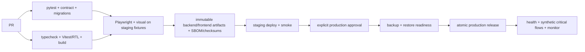

# Дорожная карта полной переработки Vechasu / Clock ERP

Baseline planning date: 2026-07-29. Это план, а не разрешение на реализацию. Каждый этап выполняется отдельным PR/feature flag; production deploy, destructive migration и external writes требуют отдельного решения.

## Принципы

1. Strangler migration, не big-bang.
2. Один authoritative write path на сущность; dual-write по умолчанию запрещён.
3. Сначала characterization, contracts и data safeguards, затем React.
4. Flask сохраняется; backend framework migration не входит в программу.
5. SQLite→PostgreSQL выполняется после изоляции repositories, не одновременно с переносом страницы.
6. Старые URL сохраняются route alias/feature flag. React и Jinja могут сосуществовать, данные — нет.
7. Каждый этап имеет reversible code flag; DB changes — expand/contract.
8. Security containment (hardcoded secret, global CSRF, permissions/security headers) — обязательный gate до расширения API.

## 21 этап

| № / этап | Входные условия | Изменения и затрагиваемые файлы | Тесты | Definition of Done | Риски / rollback / зависимости |
|---|---|---|---|---|---|
| 1. Фиксация поведения | Audit approved; scope owner assigned | Freeze route/feature inventory from six audit docs; create versioned behavior fixtures and anonymisation policy under `tests/fixtures/characterization`; no app change | Current unittest in clean pinned env; fixture schema checks | Every matrix row has owner, current result and authoritative data source | Risk hidden states; rollback N/A; dependency none |
| 2. Эталонные screenshots | Deterministic staging copy, test accounts, browser permission | Capture all states/viewports/themes from UI map under versioned visual fixtures; document fonts/timezone/data seed | Playwright capture smoke + manual review | Product owner signs baseline index; dynamic masks justified | PII in images; purge/re-capture. Depends 1 |
| 3. Characterization tests | Fixtures/screenshots approved | Add pytest wrappers around existing services/routes, fake Bitrix/MoySklad, HTTP form behavior and data invariants; preserve output | pytest unit/integration; current unittest cross-run; mutation-free external fakes | Every write flow and report total has a failing-on-change test | Tests may encode bugs; label intentional quirks. Rollback test-only. Depends 1 |
| 4. Security/data containment | Owners approve rotation/permission window | Move embedded token from `app/web.py:145` to secret config and rotate; universal unsafe-method CSRF; security headers; redact logs; inventory tracked runtime/PII; document permission matrix | CSRF matrix, auth/role, headers, secret scan, upload tests; staging smoke | No embedded secrets; all unsafe routes enforced; no regression in current forms | Session/form breakage; route-level emergency flag, secret rollback only via secret store. Depends 3 |
| 5. API contracts | Characterization green; domain ownership agreed | Freeze `/api/v1` OpenAPI/problem schema, decimal/time/error/pagination/idempotency rules; contracts under `backend/openapi` or `app/api/spec` | OpenAPI lint, golden request/response contract tests, generated TS type compile | Every feature matrix row maps to endpoint or documented client-only behavior | Contract drift; versioned additive rollback. Depends 3–4 |
| 6. Backend service layer | Contracts stable; transactional boundaries designed | Extract command/query DTOs and services from `web.py` into `app/application`; Jinja routes call services; no behavior changes | Unit service tests, route characterization, integration fakes, inventory invariants | Routes contain HTTP translation only; external side effects behind ports; same Jinja output | Shadowed/dead logic migration; switch route to legacy function. Depends 3,5 |
| 7. Repository/ORM foundation | Service boundaries and schema snapshot approved | Introduce SQLAlchemy 2 repositories behind interfaces; Alembic baseline from confirmed schema; retain SQLite adapter initially; eliminate runtime schema mutation gradually | Repository contract tests against SQLite and PostgreSQL test DB; migration round-trip | Service tests pass against interface; zero SQLite-specific SQL outside adapter; no prod migration | Query semantic/perf differences; keep legacy repository feature flag. Depends 6 |
| 8. React infrastructure | API/auth contracts and build/deploy design approved | Create `frontend/` Vite React TS, Router, Query, RHF, Zod, Vitest/RTL/Playwright config, generated API client; Nginx SPA fallback design | typecheck, lint, unit smoke, production build, asset/base-path smoke | Empty shell artifact is reproducible, no secrets, `/api` excluded from fallback | Node/build/runtime mismatch; do not route users to artifact. Depends 5 |
| 9. Design system | Visual baselines available | Import legacy tokens; implement common components from UI map, Storybook or test harness optional; no page route switch | RTL/a11y, interaction tests, per-component screenshots all themes/viewports | Core controls within pixel threshold and keyboard parity | CSS reset/portal drift; continue legacy CSS/component. Depends 2,8 |
| 10. App shell | Design components green; session/navigation API ready | React `AppShell`, sidebar, mobile nav, theme provider; hybrid route mounting; legacy page links retained | E2E navigation/session/logout, focus trap, visual all viewports/themes | Shell parity; deep links/reload work; feature flag off restores Jinja | Double nav/CSS collision; route/root flag rollback. Depends 8–9 |
| 11. Авторизация | Global CSRF/session endpoints stable | React login/register/invitation/success, route guards, JSON 401/403/429, safe next; keep secure cookie | Auth unit/API/E2E/security/visual; session expiry/tab refresh | All auth flows and edge cases parity; no token in localStorage | Lockout/CSRF loop; auth URL routes revert to Jinja. Depends 4–5,9–10 |
| 12. Товары и каталог | Product repositories/API read contracts stable | Products list/partial replacement, detail, match/delete; Bitrix catalog list/detail/mapping/import job UI; brand/category facets | Query/filter/sort/page contracts, match/data reconciliation, E2E/visual/perf | Counts/fields/images/facets/actions equal baseline; current URLs preserved | Cardinality/data mismatch; per-route flags. Depends 6–11 |
| 13. Склад и остатки | Product parity and inventory transaction service ready | Warehouse list/cells/add/edit/bulk/stock/archive; stock journal; thumbnail variants; XLSX/PDF export jobs | Stock invariants/race/idempotency, table/mobile visual, export file tests, 100k perf | Before/after stock and audit totals exact; every modal/card/table state parity | Inventory loss, bulk partials; disable React writes, keep common service/Jinja. Depends 7,9,12 |
| 14. Приход | Inventory service stable; two receipt systems ownership decided | Unified receipt API/read model; legacy MoySklad orchestration with outbox; Excel upload/draft/post/detail; reports | Parser fixtures, file security, post idempotency, external fake failures, data reconciliation, E2E/V | Same rows/totals/stock; partial remote state visible/retriable; duplicate file safe | Duplicate/partial receipt; stop jobs, revert UI, reconcile via operation log. Depends 13 |
| 15. Продажи | Inventory and customer projection stable | Migrate source tabs, filters/columns, create/edit/status/delete/return, reports; normalize adapters without changing source semantics | Atomic stock/sale/return tests, source reconciliation, API/E2E/V/export/perf | All source counts/totals/actions match; no negative/duplicate stock effects | Three-source drift; source-specific flags and read reconciliation. Depends 13 |
| 16. Заказы | Integration adapter/outbox/idempotency ready | Orders list/detail/mapping/status/writeoff; switch web from legacy helpers to configured client/service | Bitrix contract fake, timeout/retry/partial writeoff/idempotency, E2E/V | Same data/status; no embedded secret; writeoff reconcile endpoint | External duplicate write; disable writes/retry only safe steps. Depends 4,6,13 |
| 17. Ремонт | File service/retention policy approved | Repair responsive list/cards/drawer, workflow/status/logistics/files/delete; migrate JSON to repository only in separate substep | Workflow transition, concurrent edits, MIME/size/AV, E2E/V/a11y, JSON↔DB D | Case/attachments/timeline counts and file checksums match | Attachment/PII loss; read-only old store copy, route rollback, restore file snapshot. Depends 7,9–11 |
| 18. Аналитика, отчёты, настройки | Sales/receipts/inventory parity; permissions approved | SQL/read-model aggregates, async exports, analytics; settings/company/nav/themes/invitations | Golden totals/rounding, export files/PDF visual, permission/E2E/V/perf | All totals equal on fixture + production-like snapshot; settings persist | Rounding/group drift; switch report implementation/route. Depends 12–17 |
| 19. Интеграции/jobs hardening | All adapters behind ports; job infrastructure available | Durable job/outbox/inbox, retry/backoff, idempotency, redacted structured logging/metrics, admin status; catalog sync/repairs as jobs | Contract/sandbox, chaos timeout/429/5xx, replay/dedup, monitoring alerts | No HTTP request performs unbounded integration job; reconcile/retry audited | Queue outage/replay duplicates; pause workers, old manual runbook read-only. Depends 6,14,16 |
| 20. PostgreSQL migration | Repository parity, staging prod-copy, restore rehearsal, capacity plan | Alembic expand schema; ETL SQLite+JSON→Postgres; validate JSON/decimal/times/FK; read-only rehearsal; controlled cutover; no destructive cleanup | Migration twice, checksums/counts/sums/FKs/external IDs/images; shadow reads; load/lock tests | All reconciliation gates zero unexplained difference; backup restore timed; rollback window approved | Data/precision/link loss; stop writes, restore SQLite authority, archive failed PG; no dual-write prolongation. Depends 7,12–19 |
| 21. Legacy removal and production cutover | Every route parity signed; PG stable through soak; rollback rehearsed | React becomes default; keep route aliases; immutable frontend release; remove Jinja/inline assets only in later cleanup PR; atomic artifact switch; health/synthetic monitoring | Full targeted CI, Playwright critical paths, visual suite, migration/smoke/load/security, rollback drill | HTTP 200/login, critical writes/report/download, metrics/SLO green; exact release/version recorded | Build/routing/cache/rollback failure; atomic frontend symlink + backend release rollback; DB rollback rules from stage 20. Depends all |

## Детализация stage gates

### Gate A — до первого React commit

- Feature matrix approved.
- Hardcoded credential remediation scheduled/completed.
- Production backup/restore and anonymised staging copy available.
- API/auth/session/CSRF decisions approved.
- Browser screenshots captured with no PII.
- Clean test environment is reproducible and current tests green.

### Gate B — до включения каждого React route

- Existing URL and back/forward/reload verified.
- Characterization + API + E2E + visual tests green.
- Current and new outputs reconciled on the same snapshot.
- Permission and external failure states tested.
- Feature flag off returns old route without data conversion.
- Support/monitoring dashboard and owner exist.

### Gate C — до PostgreSQL

- No route/service executes SQLite-specific SQL outside legacy adapter.
- Production schema snapshot, counts, size and bad-data report captured read-only.
- Target DDL types/constraints reviewed, especially `REAL` money/stock, timestamps and JSON.
- Restore rehearsal completed and RPO/RTO accepted.
- Maintenance/freeze window and abort thresholds approved.

### Gate D — до удаления Jinja

- Feature matrix 100% signed, including mobile, imports/exports, files and integrations.
- At least one agreed soak period with React default and instant feature-flag rollback.
- No legacy-only write endpoints in access logs.
- URLs, bookmarks and redirects verified.
- Old templates retained in a rollback release until expiry of rollback window.

## План защиты данных

### 1. Инвентаризация и классификация

Create a read-only manifest for:

- `catalog.db`, `auth.db`: schema DDL/hash, SQLite version, page size, quick/integrity checks, row counts, indexes/FKs;
- all `instance/*.json`: file checksum, schema/version, record count, owner, sensitivity;
- `repair_uploads`: count, total bytes, checksums, orphan/reference report, MIME by content;
- Excel BLOBs and image URLs/files;
- Bitrix/MoySklad external IDs and last-sync cursors;
- secrets and `.env` names only, never values.

### 2. Backup before every data-affecting stage

1. Stop/hold writes only within approved window.
2. SQLite online `.backup`, JSON/files consistent snapshot, `.env` separately access-restricted.
3. Hash manifest and encrypt archive; copy off-host.
4. Record source commit, schema hash, timestamp, size and operator.
5. Verify `quick_check`, archive readability and checksum.
6. Never call a backup complete until restore succeeds in isolated staging.

### 3. Staging copy

- Restore from backup, then anonymise names/email/phones/addresses/tracking/free text while preserving lengths, duplicates, nulls and relations.
- Replace external credentials with mocks/read-only sandbox; block outbound writes at network and adapter levels.
- Preserve production scale/distribution for query testing.
- Verify anonymisation with secret/PII scanners and sample review.

### 4. Trial migration and reconciliation

Run migration at least twice from a fresh restore. Capture before/after:

| Check | Required comparison |
|---|---|
| Records | every table/entity count; active/inactive/status partitions |
| Money | sum/unit prices/report totals by date/source/currency using Decimal |
| Stock | per-product stock, total stock, negative/zero/positive counts, movement-derived balance |
| Sales | sale/item counts, returns, source/status/date totals |
| Receipts | header/row quantities, posted/draft states, file hashes |
| Product links | Excel↔Bitrix↔MoySklad IDs, cardinality, brand/category paths |
| Files/images | reference count, checksum, primary/order, accessible variant |
| Auth | user/invitation counts, roles/active, password hash unchanged |
| Audit | operation IDs, timestamps/order, reversal links |

Abort threshold is zero unexplained differences for identity, money, stock, FKs and external IDs. Expected normalization differences must have an approved mapping file and reversible transform.

### 5. PostgreSQL cutover

1. Pre-deploy code compatible with both stores, reads old store.
2. Final backup and write freeze.
3. Apply expand migrations.
4. ETL with immutable run ID and idempotent loaders.
5. Reconciliation suite and sampled domain acceptance.
6. Switch one application release to Postgres.
7. Smoke/critical write/read/report checks and metrics.
8. Keep old SQLite/JSON immutable through rollback retention; do not delete.
9. Resume writes only after gate.

Avoid long-running dual-write. If rollback after Postgres accepts new writes must be supported, predefine a reverse journal/export and maximum rollback window; otherwise rollback means restore final backup and lose post-cutover writes, which requires explicit business approval.

### 6. Destructive migration policy

- Separate PR and separate explicit approval.
- Backup restore proven immediately beforehand.
- Expand first; read old/new; only after retention drop old column/table/file.
- No `DROP`, irreversible normalization or attachment deletion in the same deploy as cutover.
- Alembic downgrade is not assumed sufficient for data rollback; data restore/reverse transform is documented.

## CI/CD target

No secrets in frontend build or CI logs. Frontend artifact and backend release are version-linked but independently rollbackable while API compatibility window remains.

## Programme-level acceptance

The programme is complete only when:

- every matrix row is `parity accepted`;
- all current URLs work or have approved redirects;
- all data reconciliation checks pass;
- production restore and rollback are rehearsed;
- no Jinja-only business write path remains;
- React critical-path Playwright and visual suites are green;
- integration retry/idempotency/reconciliation are operational;
- observability proves agreed latency/error SLO during soak;
- old code/data are removed only in a later explicitly approved cleanup.
