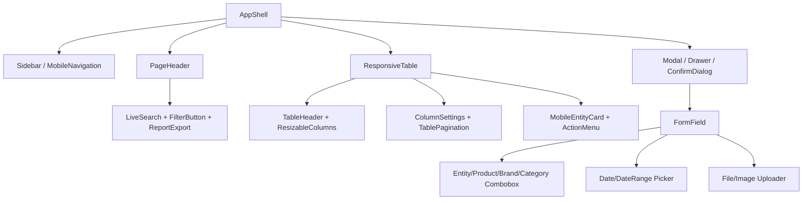

# Карта интерфейса и React-компонентов

Baseline: `origin/main@2212988`, 2026-07-29. Карта составлена по всем Jinja templates, CSS и JavaScript. Скриншоты в рамках аудита не создавались браузером; существующие reference files перечислены ниже.

## 1. Дизайн-система текущего UI

### Общая оболочка

- Desktop: fixed sidebar шириной 228 px, collapsed 72 px; content offset изменяется классами. Collapse сохраняется в `localStorage` (`_sidebar.html`, `sidebar.css:1-669`, `sidebar.js:1-311`).
- Mobile `<=767px`: sidebar заменяется bottom navigation, дополнительные пункты открываются через «Ещё» dialog с focus trap/Escape. Это функциональность, не только styling.
- Темы: `classic`, `klok-green`, `bn0024-white`; preference key `vechasu-erp-theme-v1` (`themes.css:1-1384`, `theme.js:1-157`).
- Базовый визуальный язык: Inter/system sans-serif, navy/blue classic palette, light surfaces, cards около 16 px radius, inputs/buttons около 40–44 px, тонкие borders/shadows. Точные CSS custom properties нужно импортировать как design tokens до первой React-страницы.
- Shared components уже частично определены в `erp-components.css:1-3007`: page headers, buttons, search/filter controls, tables/cards, forms, modals, status chips, responsive variants.

### CSS/JS debt

| Вывод | Доказательство | Риск |
|---|---|---|
| Огромный inline слой | `warehouse.html` 6696, `sales.html` 6333, `receipts.html` 4545 строк | selector/order specificity changes при componentisation |
| Дублирование | похожие table/filter/modal/card styles повторены в каждом крупном template и `erp-components.css` | одинаковый вид реализован разными размерами/DOM |
| DOM coupling | inline scripts используют IDs/classes, `innerHTML`, hidden fields, dataset, direct event listeners | React markup может незаметно сломать поведение |
| Server HTML dependency | `/products` возвращает partial results; forms/flash/validation серверные | нужна contract-driven state model |
| Breakpoint fragmentation | встречаются 430, 560, 600, 640, 700, 760/767, 800, 850, 900, 1050, 1080, 1100, 1180, 1200, 1380, 1450 px | visual drift между страницами |
| Preference storage | sidebar/theme/table column settings хранятся client-side под разными keys | migration/namespace compatibility |
| Shared behavior | `catalog-combobox.js`, `period-picker.js`, sidebar/theme scripts | нельзя удалять до behavioral parity |

Рекомендация: сначала создать `legacyTokens.css` с неизменёнными variables и геометрией, затем headless React behavior, потом components. Не «улучшать» UI в parity phase.

## 2. Реестр страниц и состояний

### Auth и shell

| URL / template | Структура и controls | Состояния/адаптивность | Обязательные visual/E2E baselines |
|---|---|---|---|
| `/login`, `login.html` + `auth_base.html` | Центрированная auth card, logo/title, email/password, primary submit, error/next | mobile full-width card; focus/error; rate-limit | desktop/mobile: default, invalid, disabled/rate-limited, keyboard |
| `/register`, `register.html` | Multi-step invitation/identity/password form, live invitation validation | step transitions, validation, expired/used token; mobile stacking | first admin, valid invite, invalid/expired, field errors, success transition |
| `/register/success` | Success card + login CTA | responsive card | desktop/mobile |
| Settings invitations | Inline panel/table, create form, generated one-time link, revoke | empty/list/created/error; admin-only | default/created/revoked/mobile |
| All authenticated pages | Sidebar, active icon/label, collapse, logout; mobile bottom bar/more dialog | desktop expanded/collapsed, tablet edge, mobile safe-area/focus trap | every theme at 1440; shell at 1024/768/390 |

### Orders

| URL / template | Структура и controls | States/behavior | Baselines |
|---|---|---|---|
| `/`, `/order/{id}`, `orders.html` | Page header, order summary/list/detail, status chips/select, product rows, mapping combobox, write-off forms/actions | loading remote data server-side, empty/error flash, mapped/unmapped items, status update/writeoff confirmation; responsive cards/table | list normal/empty/error; detail mapped/unmapped; status dropdown; mapping; writeoff validation/partial error; mobile 390 |

### Products and Bitrix catalog

| URL / template | Структура и controls | States/behavior | Baselines |
|---|---|---|---|
| `/products`, `excel_products.html`, `_excel_products_results.html` | Header, upload receipt CTA, live search, filter button/count, facets, sortable/resizable table, pagination, result partial | XHR partial loading/error, no results, match badges, images; desktop table/mobile layout | 1440 tracked screenshot; loading, filters open, no results, pagination, mobile |
| `/products/{id}`, `excel_product_detail.html` | Back/header, product identity, stock/cell, Bitrix match/cardinality, image gallery, properties, match/delete actions | matched/unmatched/shared, missing image/properties, confirm delete | all three match states, image fallback, dialog, mobile |
| `/products/receipts/new`, upload template | File drop/input, rules, submit/error | drag/focus/invalid extension/oversize/uploading | default, drag, validation, loading, mobile |
| `/products/receipts/drafts/{id}`, preview template | Summary metrics, valid/error/excluded row tables, post action | parser errors, duplicate, zero/positive, posting/posted | tracked 1280 screenshot; mixed errors, all valid, posting, mobile |
| `/products/receipts/{id}`, detail template | Receipt header/totals/rows and links | posted rows, created vs matched badges | desktop/mobile |
| `/catalog`, `catalog.html` | Catalog header, search/category/active filters, products pagination/cards/table | empty/error, active/inactive, descriptions/images | default/filter/page/mobile |
| `/catalog/{id}`, `catalog_detail.html` | Product description, categories, offers, prices, properties, gallery | no offer/image/property; sanitized links | representative rich/empty/mobile |
| `/catalog/import-preview`, preview template | Import counters/diffs/errors/actions | loading currently server-bound, conflicts/errors/empty | success/conflict/error |
| `/catalog/mapping`, mapping template | Candidate rows, confidence/status, confirm forms | mapped/ambiguous/no match/MoySklad error | all match states/mobile |

### Warehouse/inventory

| URL / template | Структура и controls | States/behavior | Baselines |
|---|---|---|---|
| `/warehouse`, `warehouse.html` | Page header/actions/export; live search; stock toggle; filter button/badge/drawer; sortable/resizable/column-config table; pagination; selection/bulk bar; add/edit/stock/cell/archive dialogs; thumbnails; mobile product cards | initial/filtered/loading/empty/error; selected/bulk; image upload preview; validation; destructive confirm; preferences; 50/100/200 pages | desktop 1440 all dialogs, filter badge, in-stock toggle, resized/hidden columns; tablet 1024/768; mobile 390 cards/menu; no-image/long text |
| `/warehouse/export.*` | Trigger/download feedback | exporting/error | action loading/error, downloaded file contract |
| `/stock-operations`, template | Header, filters/date/source, operation table/details | empty/large/negative/positive | desktop/mobile, filter/no results |
| Warehouse cell/category mapping | Embedded forms/selectors | inherited/missing/edited cell | edit success/error, mobile |

### Sales and reports

| URL / template | Структура and controls | States/behavior | Baselines |
|---|---|---|---|
| `/sales`, `sales.html` | Header/add/export; source tabs; period picker/calendar; live filters; column settings/resizing; table/mobile cards; manual/automatic edit forms; status/actions; return/delete confirms | source-specific columns/actions; loading/empty/filter; product combobox; stock validation; returned/deleted; local preferences | desktop each source; calendar; filter drawer; columns; add/edit manual; edit automatic; status/return/delete; errors; mobile each source |
| `/sales/report`, `sales_report.html` | Filter summary, totals, report table, export links | empty/large/long values | desktop/print-like/mobile |
| `/sales/report.xlsx|pdf` | Download interaction | loading/failure | file assertions; PDF screenshot |

### Receipts

| URL / template | Структура and controls | States/behavior | Baselines |
|---|---|---|---|
| `/receipts`, `receipts.html` | Header/report/create/import; filter/table; receipt create/edit modal; product combobox rows; Excel preview; delete confirm | MoySklad loading/error, empty/list; dynamic rows/totals; mapped/unmapped; upload/validation; create/update/delete partial failure | default/list/empty; create/edit/import; product search; errors; delete; tablet/mobile |
| `/receipts/report`, `receipts_report.html` | Filters, summary, table | no results/large | desktop/mobile |

### Repairs

| URL / template | Структура and controls | States/behavior | Baselines |
|---|---|---|---|
| `/repair`, `repair.html` | Header/add; search/filter/status counters; desktop table/mobile cards; detail/edit drawer; status/action controls; logistics; attachments; delete confirm | empty/error; status transitions; file list/upload errors; focus/escape; long customer/device/tracking text | existing 1440/390 screenshots; all filters; create/edit; each status; logistics; attachment upload/download; confirm; errors |

### Analytics and settings

| URL / template | Структура and controls | States/behavior | Baselines |
|---|---|---|---|
| `/analytics`, `analytics.html` | Page header, period filters, KPI cards, grouped sections/tables | zero data/normal/long labels | desktop/tablet/mobile, each theme |
| `/settings`, `settings.html` | Header, company form, theme cards/select, navigation toggles, invitation panel | saved/error, required nav item disabled, admin vs employee | desktop/mobile, each theme, permission difference |

### Отсутствующие самостоятельные страницы

Brands, categories, customers, companies (кроме 3 settings fields), users/roles (кроме invitations), CDEK и email integration не имеют routes/pages. Их нельзя «восстановить» как существующий UI. Если продукт решит создать страницы, это новый scope после parity.

## 3. Реестр будущих React-компонентов

Общие props в таблице сокращены: `className`, `id`, test id и arbitrary DOM spreading не должны быть обязательной частью public API. Все controls поддерживают visible focus, keyboard, disabled/loading и accessible name.

| Компонент | Назначение и ключевые props | Состояния / a11y / responsive | Текущая реализация / страницы | Риск |
|---|---|---|---|---|
| `AppShell` | `user,navItems,theme,children` | skip link, landmarks; desktop/sidebar vs mobile/bottom | `_sidebar.html`, all app pages | высокий: offsets/safe-area |
| `Sidebar` | items, activeKey, collapsed, onToggle | nav semantics, tooltip collapsed, persisted state | sidebar HTML/CSS/JS | высокий: 228/72 geometry |
| `MobileNavigation` | primaryItems, overflowItems | bottom nav, dialog focus trap, safe area | sidebar mobile | высокий: focus/z-index |
| `PageHeader` | title, subtitle, breadcrumbs, primary/secondary actions | wraps/stacks at mobile | repeated page CSS | medium |
| `DataTable<T>` | columns, rows, sort, selection, rowActions, density | loading/empty/error; semantic table/keyboard | warehouse/sales/products/receipts | very high |
| `TableHeader` | sortable/resizable column descriptors | `aria-sort`, resize keyboard alternative | inline table JS | high |
| `TablePagination` | page, pageSize, total, onChange | disabled boundaries, accessible labels; condensed mobile | products/warehouse/catalog | medium |
| `ColumnSettings` | columns, visibility/order/reset | menu/dialog, checkbox labels, persisted schema version | sales/warehouse JS | high |
| `ResizableColumns` | widths,min/max,onCommit | pointer + keyboard; disable on mobile cards | sales/warehouse JS | high |
| `LiveSearch` | value,onChange,debounceMs,loading,results? | clear button/status live region, IME safe | page searches/combobox JS | high |
| `FilterButton` | count,active,onClick | badge announced, pressed/expanded | repeated filters, `_filter_count` | medium |
| `FilterPanel` | fields,values,onApply,onReset | focus order, desktop anchored panel | products/catalog/pages | high |
| `FilterDrawer` | open,onClose,children | dialog, focus trap, Escape; mobile full-height | warehouse/sales mobile | high |
| `Combobox<T>` | items/value/input/onQuery/renderOption | ARIA combobox/listbox, async/loading/empty/error | `catalog-combobox.*`, inline variants | very high |
| `EntityCombobox<T>` | endpoint,query,selected entity | async cancellation/cache, selected summary | generic extraction | high |
| `BrandCombobox` | exact brand value/count, allowCustom? | preserves case/spacing policy | product/warehouse forms | high: normalization |
| `CategoryCombobox` | tree/path/value, allowCustom? | hierarchical labels/keyboard | product/warehouse/catalog filters | high |
| `ProductCombobox` | product summary, stock, article, thumbnail | stock-disabled option, virtualized list | sales/receipts/orders mapping | very high |
| `DatePicker` | value,min,max,locale,onChange | keyboard/calendar/grid, manual entry | inline date inputs | medium |
| `DateRangePicker` | from,to,presets,onChange | invalid range/errors, responsive popover | `period-picker.*`, sales/reports | high |
| `Modal` | open,title,onClose,size,footer | `role=dialog`, labelled, trap, restore focus, Escape | many inline modals | very high |
| `Drawer` | side/open/title/onClose | same dialog rules; full-screen mobile | repair/filter/edit drawers | very high |
| `ConfirmDialog` | title,body,confirmLabel,tone,onConfirm | destructive focus, pending/error, no accidental Enter | delete/archive/return | high |
| `Toast` | tone,title,description,action,duration | live-region severity, pause on hover/focus | flash/inline notifications | medium |
| `FormField` | label,hint,error,required,control | label association, error IDs, disabled/read-only | all forms | medium |
| `FileUploader` | accept,maxSize,maxFiles,onFiles,progress | drag/drop+button, validation/status live | repair/Excel | high |
| `ImageUploader` | accept,crop?,preview,onUpload | magic/MIME errors, alt prompt, progress | warehouse product edit | high |
| `ImageGallery` | images,primary,onOpen | alt, thumbnails, keyboard/lightbox | product/catalog pages | medium |
| `EmptyState` | icon,title,description,action | not announced as error | all list pages | low |
| `LoadingState` | variant,rowCount,label | `aria-busy`, non-flashing skeleton | all async routes | medium |
| `ErrorState` | title,detail,retry,requestId | alert only when new; support copy | all API queries | low |
| `ActionMenu` | items,anchorLabel | menu keyboard/disabled/reasons; bottom sheet mobile | row actions | high |
| `EditAction` | permission,onInvoke | disabled explanation | products/sales/receipts/repair | low |
| `DeleteAction` | permission,entityLabel,onConfirm | always confirm; pending | same | medium |
| `BulkActions` | selectedCount,actions,onClear | sticky toolbar, mobile sheet, live count | warehouse | high |
| `ReportExport` | report,formats,filters,columns | job progress/error/download/expiry | warehouse/sales reports | medium |
| `ResponsiveTable` | tableProps,cardRenderer,breakpoint | semantic table desktop, list cards mobile | warehouse/sales/repair | very high |
| `MobileEntityCard` | fields,actions,status,href | ordered reading/focus, 44px actions | warehouse/sales/repair | high |
| `StatusBadge` | status,tone,label | never color-only | every domain | medium |
| `SourceTabs` | sources,current,counts | tablist keyboard; horizontally scroll mobile | sales | high |
| `ProductThumbnail` | src/fallback,size,alt | lazy load, reserved box, fallback | warehouse/products/receipts | medium |
| `JobProgress` | state,counters,errors,cancel/retry | progressbar/live update; compact mobile | imports/exports/integrations | new, medium |

## 4. Страница → component composition

| Page | Feature components beyond shell |
|---|---|
| Orders | `OrdersTable`, `OrderDetail`, `OrderStatusSelect`, `ProductCombobox`, `OrderWriteoffDialog` |
| Products | `ProductTable`, facets, `ProductMatchDialog`, `ImageGallery`, receipt upload/preview tables |
| Warehouse | `ResponsiveTable`, stock toggle, filters, columns, bulk bar, `ProductFormDrawer`, `StockAdjustmentDialog` |
| Sales | `SourceTabs`, period picker, filters/columns, `SaleFormDrawer`, `ReturnDialog`, report export |
| Receipts | `ReceiptTable`, `ReceiptFormPage`, dynamic item rows, `ProductCombobox`, Excel uploader/preview |
| Repairs | `RepairsTable`, cards, `RepairDrawer`, status/actions, `LogisticsForm`, `FileUploader` |
| Catalog | catalog filters/table/detail/gallery, mapping candidates, import `JobProgress` |
| Analytics | period filters, `KpiCard`, summary tables |
| Settings | company fields, `ThemePicker`, navigation toggles, invitations |

## 5. CSS migration rules

1. Export current custom properties, font stacks, sizes, radii, shadows and z-index layers verbatim into `frontend/src/shared/styles/legacy-tokens.css`.
2. Map every current selector to one React component in a migration ledger. Delete old selectors only after screenshot parity.
3. No global reset replacement during parity. Normalization changes can shift every control by 1–3 px.
4. Maintain current CSS load order during hybrid phase; scope React root with a predictable layer, not random CSS Modules precedence.
5. Establish z-index tokens: base, sticky header/table, dropdown, drawer overlay, modal, toast. Verify nested combobox in modal.
6. Preserve existing localStorage keys or migrate once with versioned adapter.
7. Consolidate breakpoints only after visual parity. Initial component breakpoints should reflect the page being replaced.
8. Use reserved image aspect/size to prevent layout shifts; do not proxy originals directly for thumbnails.

## 6. Visual regression programme

### Viewports and themes

- Desktop: `1440×900`.
- Narrow desktop/tablet landscape: `1024×768`.
- Tablet portrait: `768×1024`.
- Mobile: `390×844`; critical auth/upload also `360×800`.
- All core pages: `classic`; shell/settings and representative table/form/modal also `klok-green` and `bn0024-white`.

Existing artifacts: `docs/screenshots/products-daily-ui-1440.png`, `excel-receipt-preview-1280.png`, `repair-ui-1440.jpg`, `repair-ui-390.jpg`. Они покрывают лишь 3 areas and do not replace a new authenticated baseline suite.

### Required states

Каждая data page: deterministic normal data, loading/skeleton, empty, API error, validation error, long text, missing image, first/last page, filter applied/no results. Каждая mutation: default form, focus, invalid, disabled/pending, success toast, conflict, forbidden and external timeout. Destructive actions: closed/open/pending/error. Tables: default, sorted asc/desc, columns hidden/reordered/resized, selected/bulk, horizontal overflow. Mobile: menu, action sheet/drawer, keyboard-safe form, sticky/bottom navigation.

### Threshold and acceptance

- Playwright screenshots with frozen clock/timezone, deterministic anonymized fixtures, fonts ready and animations disabled.
- Pixel mismatch target `<=0.1%` for stable components/pages; temporary maximum `0.2%` only with reviewed diff. Geometry tolerance: 1 px.
- Masks allowed only for explicitly dynamic timestamp/opaque image areas, never for controls, totals, tables or layout.
- Assertions complement screenshots: bounding boxes, column order/width, focus target, scroll containment, visible/disabled state and 44 px mobile touch targets.
- Hover/focus/disabled captured as component snapshots; drawers/modals tested for focus trap, Escape and restored focus.
- Manual acceptance compares paired old/new pages at all four viewports, runs critical workflows, checks content/amount/stock, keyboard and screen-reader landmarks. Product owner signs a page checklist before feature flag switches.

## 7. Highest visual-regression risks

1. Warehouse and sales responsive tables/card transformations.
2. Resizable/hidden column persistence and table width calculations.
3. Combobox portals inside modals/drawers and z-index/focus.
4. Mobile bottom navigation, safe-area and «Ещё» focus trap.
5. Period picker positioning, locale and manual dates.
6. Inline server errors/flash placement versus async toasts.
7. Three themes with page-local hard-coded colors.
8. Long Russian names/articles/customer fields changing row height.
9. Product image fallbacks and asynchronous aspect-ratio changes.
10. PDF/report visual output: React does not replace server document rendering without a separately approved parity project.
